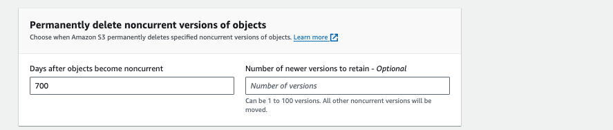
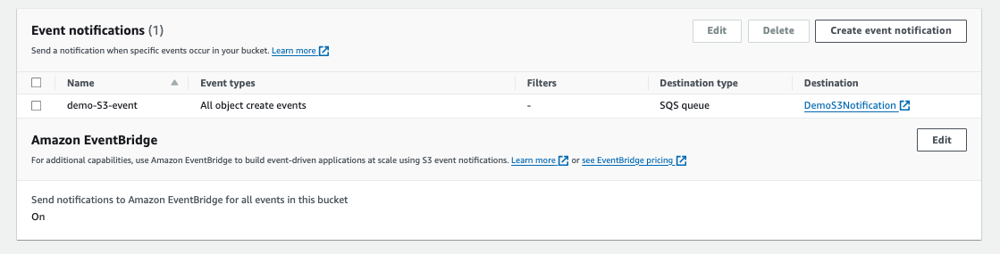
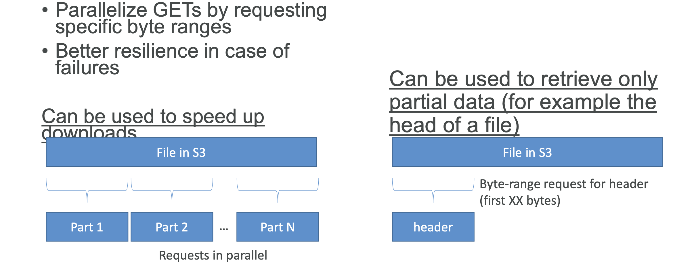

**Storage**

- [Set up an AWS Billing Alarm](#set-up-an-aws-billing-alarm)
- [Amazon S3](#amazon-s3)
  - [S3 - Hands On](#s3---hands-on)
  - [S3 - Security - Bucket Policy](#s3---security---bucket-policy)
  - [S3 - Versioning Overview](#s3---versioning-overview)
  - [S3 - Versioning Hands on](#s3---versioning-hands-on)
  - [S3 - Replication](#s3---replication)
  - [S3 - Replication Hands On](#s3---replication-hands-on)
  - [S3 - Storage Classes Overview](#s3---storage-classes-overview)
  - [S3 - Storage Classes Hands On](#s3---storage-classes-hands-on)
  - [S3 - Lifecycle Rules](#s3---lifecycle-rules)
  - [S3 - Lifecycle Rules - Hands On](#s3---lifecycle-rules---hands-on)
  - [S3 - Event Notifications](#s3---event-notifications)
    - [S3 - Event Notifications – IAM Permissions](#s3---event-notifications--iam-permissions)
    - [S3 - Event Notifications with Amazon EventBridge](#s3---event-notifications-with-amazon-eventbridge)
  - [S3 - Event Notifications - Hands On](#s3---event-notifications---hands-on)
  - [Amazon S3 - Performance](#amazon-s3---performance)
  - [Amazon S3 – Object Encryption](#amazon-s3--object-encryption)
    - [S3 Encryption – SSE-S3](#s3-encryption--sse-s3)
    - [S3 Encryption – SSE-KMS](#s3-encryption--sse-kms)
    - [S3 Encryption – SSE-C](#s3-encryption--sse-c)
    - [S3 Encryption – Client-Side Encryption](#s3-encryption--client-side-encryption)
    - [S3 – Encryption in transit (SSL/TLS)](#s3--encryption-in-transit-ssltls)
    - [S3 – Force Encryption in Transit aws:SecureTransport](#s3--force-encryption-in-transit-awssecuretransport)
    - [DSSE-KMS](#dsse-kms)
  - [S3 - Encryption - Hands On](#s3---encryption---hands-on)
  - [S3 - Default Encryption vs. Bucket Policies](#s3---default-encryption-vs-bucket-policies)

## Set up an AWS Billing Alarm

`Billing and Cost Management` > `Budgets` > Overview

... and create a new budget.

* `Zero spend budget` : Create a budget that notifies you once your spending exceeds $0.01 which is above the AWS Free Tier limits.
* `Monthly cost budget` : Create a monthly budget that notifies you if you exceed, or are forecasted to exceed, the budget amount.

## Amazon S3

### S3 - Hands On

https://github.com/alexjust-data/AWS_Certified_Cloud_Practitioner?tab=readme-ov-file#s3-hands-on

### S3 - Security - Bucket Policy

https://github.com/alexjust-data/AWS_Certified_Cloud_Practitioner?tab=readme-ov-file#s3-security-bucket-policy-hands-on

### S3 - Versioning Overview

https://github.com/alexjust-data/AWS_Certified_Cloud_Practitioner?tab=readme-ov-file#s3---versioning-overview

### S3 - Versioning Hands on

https://github.com/alexjust-data/AWS_Certified_Cloud_Practitioner?tab=readme-ov-file#s3---versioning-hands-on

### S3 - Replication

https://github.com/alexjust-data/AWS_Certified_Cloud_Practitioner?tab=readme-ov-file#amazon-s3--replication

**Replication (Notes)**
* After you enable Replication, only new objects are replicated
* Optionally, you can replicate existing objects using S3 Batch Replication
  * Replicates existing objects and objects that failed replication
* For DELETE operations
  * Can replicate delete markers from source to target (optional setting)
  * Deletions with a version ID are not replicated (to avoid malicious deletes)
* There is no “chaining” of replication
  * If bucket 1 has replication into bucket 2, which has replication into bucket 3
  * Then objects created in bucket 1 are not replicated to bucket 3

### S3 - Replication Hands On

https://github.com/alexjust-data/AWS_Certified_Cloud_Practitioner?tab=readme-ov-file#amazon-s3--replication

### S3 - Storage Classes Overview

https://github.com/alexjust-data/AWS_Certified_Cloud_Practitioner?tab=readme-ov-file#s3-storage-classes-overview

### S3 - Storage Classes Hands On

Let's create a new bucket in S3 and call it s3-storage-classes-demo-2025-v1. I'll choose any region and go ahead and create this bucket.

https://github.com/alexjust-data/AWS_Certified_Cloud_Practitioner?tab=readme-ov-file#s3-storage-classes-hands-on

### S3 - Lifecycle Rules

So now let's talk about how we can move objects between different storage classes, so you can transition them, and this is the diagram of how it's possible. As you can see, you can go from the standard, for example, to standard IA, to intelligent tiering, to one-zone IA, and then from one-zone IA, as you can see, you can go to flexible retrieval or deep archive, and so all the types of permutations are shown in this graph. As a matter of fact, if you know that your objects are going to be infrequently accessed, then move them to standard IA, and if you know that you're going to archive objects, move them into the glacier of tiers or the deep archive tier.

Now, moving these objects can be done manually, of course, but we can automate this using lifecycle rules. These lifecycle rules are made up of multiple things. The first thing is a transition action to configure the object to transition to another storage class. For example, you could say move to standard IA class 60 days after creation, or move to Glacier for archiving after six months. You can also set up expiration actions to configure objects to be deleted or expired after some time. For example, your access log files may be set to delete after 365 days. Or you could, for example, use an expiration action to delete all versions of files if you have enabled versioning. Alternatively, you can use this to delete incomplete multi-part uploads if, for example, the multi-part upload is more than two weeks old because, well, the thing should have been fully uploaded by now.

* `Transition Actions` – configure objects to transition to another storage class
  * Move objects to Standard IA class 60 days after creation
  * Move to Glacier for archiving after 6 months
* `Expiration actions` – configure objects to expire (delete) after some
time
  * Access log files can be set to delete after a 365 days
  * Can be used to delete old versions of files (if versioning is enabled)
  * Can be used to delete incomplete Multi-Part uploads
* Rules can be created for a certain `prefix` (example:s3://mybucket/mp3/*)
* Rules can be created for certain `objects` Tags (example: Department:
Finance)

**Scenarios**

Here are some scenarios. For example, you have an application on EC2, and it creates images or thumbnails after profile photos are uploaded to Amazon S3. But these thumbnails can be easily recreated from the original photo, and they only need to be kept for 60 days. However, the source images should be immediately retrievable for these 60 days, and afterward, the user can wait up to six hours. How would you design this? This is what an exam question might ask you.

The S3 source images can be on the standard class with a lifecycle configuration to transition them to Glacier after 60 days. The thumbnail images—this is how you use a prefix to differentiate between source images and thumbnails, for example—can be on one zone IA, because while they are infrequently accessed, they can be easily recreated. You can have a lifecycle configuration to expire or delete them after 60 days.

Lifecycle Rules (Scenario1)

* Your application on EC2 creates images thumbnails after profile photos are uploaded to Amazon S3. These
thumbnails can be easily recreated, and only need to be kept for 60 days. The source images should be able to be immediately retrieved for these 60 days, and afterwards, the user can wait up to 6 hours. How would you design this?
* S3 source images can be on Standard, with a lifecycle configuration to transition them to Glacier after 60 days
* S3 thumbnails can be on One-Zone IA, with a lifecycle configuration to expire them (delete them) after 60 days

Lifecycle Rules (Scenario 2)

Another scenario: a rule in your company states that you should be able to recover deleted S3 objects immediately for 30 days, although this may happen rarely. After this time, for up to 365 days, deleted objects should be recoverable within 48 hours. For this, we can enable S3 versioning to keep and have object versions so that the deleted objects are, in fact, hidden by a delete marker and can then be recovered. Then you will create a rule to transition the non-current versions of the objects to standard IA, meaning the versions that are not the top-level versions, and then transition these non-current versions to Glacier Deep Archive for archival purposes.

* A rule in your company states that you should be able to recover your deleted S3 objects immediately for 30 days, although this may happen rarely. After this time, and for up to 365 days, deleted objects should be recoverable within 48 hours.
* Enable S3 Versioning in order to have object versions, so that “deleted objects” are in fact hidden by a “delete marker” and can be recovered
* Transition the “noncurrent versions” of the object to Standard IA
* Transition afterwards the “noncurrent versions” to Glacier Deep Archive

**Storage Class Analysis**

Lastly, how do we determine the optimal number of days to transition an object from one class to another? You can do this thanks to Amazon S3 Analytics, which provides recommendations for standard and for standard IA. It does not work with Amazon IA or Glacier. The S3 bucket will have S3 Analytics run on top of it, and this will create a CSV report that provides recommendations and statistics. The report is updated daily, and it can take between 24 to 48 hours to start seeing data analysis results. This CSV report is a good first step in creating lifecycle rules that make sense or in improving them.

### S3 - Lifecycle Rules - Hands On

So let's go ahead and create a lifecycle rule for our bucket. 

Let's go under Management and create a lifecycle rule. 

This one is going to be called DemoRule, and we apply it to all the objects in the bucket, and I acknowledge it.

you can see we have five different rule actions. We can move current versions of objects between storage classes, move non-current versions of objects between storage classes, expire current versions of objects, permanently delete non-current versions of objects, and finally, delete expired objects, delete markers, or incomplete multi-part uploads. So, five different use cases. Let's have a look at them one by one.

**move current version objects between storage classes**, 

it means that you have a versioned bucket, and the current version is the most recent version—the one displayed to the user. For example, we can transition to standard IA after 30 days. Then, we can move to each IA after 60 days. After that, we can go into Glacier for instant retrieval after 90 days. Then, after 180 days, we can move to flexible retrieval. Finally, we might archive to deep archive after 365 days. You can have as many transitions as you want, okay? And we need to check the box to acknowledge what we do.

**move non-current versions faster**. 

For this, we want to move an object that is non-current—meaning an object that has been "overridden" by a newer one. We could say, "Okay, we want to move it to Glacier flexible retrieval because we know that after 90 days, we won't need it for immediate retrieval, so this is perfect." And we're good to go, but we could add more transitions.

For example, we might want to **expire current versions of objects**, and at the bottom, you can set it up to happen after 700 days. 

  
  

Similarly, for non-current objects, we want to permanently delete them after 700 days as well, okay? So, this is something we can do.

Now we can have a look at all these transitions and expiration actions. This is nice because it shows you a timeline of what is going to happen to your current and non-current versions of your objects. 

If we're happy with all of this, we can just go ahead and create this rule. This rule will act in the background to do what it's supposed to be doing.

That's it. Now you know how to automate moving objects in our industry between different storage classes. I hope you liked it, and I will see you in the next lecture.

### S3 - Event Notifications

So now let's talk about S3 event notifications. The idea is that new events are going to happen in Amazon S3. What are events? Well, events are things such as when an object is created, an object is removed, an object is restored, or there is replication happening. You can filter these events. For example, you can specify that you only want to consider objects that end with ".jpeg".

The use case for event notifications would be, for example, to automatically react to certain events happening in Amazon S3. For instance, if you want to generate thumbnails of all the images uploaded to Amazon S3, you can create an event notification and send it to a couple of destinations. These destinations could be an SNS topic, an SQS queue, or a Lambda function. Don’t worry if you are not familiar with these services yet; we will cover them in the next lectures.

You can create as many S3 events as you desire, and you can send them to any target you want. The idea is that these events are typically delivered within seconds to their destinations, but sometimes it can take a minute or longer.

#### S3 - Event Notifications – IAM Permissions

For the event notifications to work, we need to have the correct IAM permissions. For example, if the S3 service is sending data to an SNS topic, we need to attach what’s called an SNS Resource Access Policy. This is an IAM policy that you attach to the SNS topic, allowing the S3 bucket to send messages directly to the SNS topic. Similarly, if we use SQS, we create an SQS Resource Access Policy that authorizes the S3 service to send data to our SQS queue.

Finally, for a Lambda function, we need a Lambda Resource Policy attached to our Lambda function to ensure that Amazon S3 has the right to invoke our function. Here, we don’t use IAM roles for Amazon S3; instead, we define Resource Access Policies on the SNS topic, the SQS queue, or the Lambda function. These policies function similarly to the S3 bucket policy we used before.

So, you should remember that SNS, SQS, and Lambda functions are event notification targets. 

#### S3 - Event Notifications with Amazon EventBridge

But now, there's a fourth integration that you will also learn about. All events from your Amazon S3 bucket end up in Amazon EventBridge, no matter what. From EventBridge, you can set up rules to send these events to over 18 different AWS services as destinations. This really enhances the capability of S3 event notifications.

We will explore EventBridge later on in this course, but with EventBridge, you get advanced filtering options—much more than before. You can filter by metadata, object size, and name, send to multiple destinations simultaneously, set up step functions, use data streams or Firehose, and access features directly from Amazon EventBridge, such as archiving events, replaying events, and achieving more reliable delivery.

Okay, there’s a lot we haven’t covered in this lecture about the new services, but let's just focus on Amazon S3 event notifications. The idea is that you can react to events happening in Amazon S3 by sending them to SQS, SNS, Lambda, or Amazon EventBridge.

* **Advanced filtering** options with JSON rules (metadata, object size, name...)
* **Multiple Destinations** – ex Step Functions, Kinesis Streams / Firehose…
* **EventBridge Capabilities** – Archive, Replay Events, Reliable delivery

### S3 - Event Notifications - Hands On

So let's go ahead and demonstrate S3 event notifications. For this, I'm going to create a bucket. 

I'll call it `demo-alexjust--event-notifications`. Once I'm ready, I will just go ahead and create my bucket.

click **`Create bucket`**

Okay, so my bucket is created. I'm going to go into it. Now, I'm going to make sure that event notifications are set up. So I go to **`Properties`**, scroll down, and then here we have `event notifications`.

As you can see, we have two options. Number one is to `create an event notification`, and I will show you this in a second. Number two is to enable the `Amazon EventBridge` integration to send all events from this S3 bucket to EventBridge. 

To do this, you just turn it `on`, and you're good to go.

If I wanted to, I could use Amazon EventBridge to capture the events happening in my S3 bucket.

However, I'll show you the simpler way first, because it's a bit more straightforward, which is to just create an `event notification` and send it, for example, to SQS.

I'll call this one demo-event-notification. Then, we can set up a prefix or a suffix, but I won't do that now. 

Next, we need to choose event types. We want to react to all object create events. This means that any time an object is created, an event is going to be triggered. If you want, you could get more granular and select specific types of events, but to keep it simple, I'll leave it at that. You can also include, for example, object removals or object restores, and on the right-hand side, it shows you all the events you can catch. I'll keep it simple and just scroll down. As you can see, there are lots of different events you can react to in Amazon S3.

Then, you need to publish to a destination. We have three options: Lambda functions, SNS topics, and SQS queues. I'm going to choose SQS queue, but first, we need to create a queue and authorize Amazon S3 to publish messages to that destination. 

So, what I'm going to do now is go into Amazon SQS and create a queue. 

I'll call this one `demo-S3-notification`. I'll go ahead and **`create queue`**.

and it's created. 

Now, I need to update the access policy to allow my S3 bucket to write to my SQS queue.

To demonstrate the issue, if I go back here and refresh the page to see my queue appear, 

I refresh it, select `demo-S3-event`, choose `all object create events`, scroll down, and then choose the SQS queue. I can select the queue from the dropdown, demo-S3-notification. 

However, if I try to save my changes, I get an unknown error saying that it can't validate the destination configuration 

because this SQS queue does not yet accept messages from my S3 bucket.

To resolve this, I need to change the access policy by clicking on "Edit." 

Scroll down to where the access policy is, and we need to generate a new policy. 

So, I go to the policy generator. It will be an SQS queue policy, 
* Princial : **`*`**
* Actions : **`send messages`**
* Amazon Resource Name (ARN) : 

I add a statement and then generate this policy. 

Now, this is the policy I want to use, which allows anyone to write to my SQS queue. It's very permissive, but it will work. Click below to edit. To save the policy, copy the text below to a text editor. Changes made below will not be reflected in the policy generator tool.

Changes the policy generator tool.

Let's **`save`** this, and now my access policy has been updated.

So, if I go back and try to save my changes again, 

**`save changes`** as you can see, the operation was successfully completed. 

What happened is that if I go into my SQS queue and click on "Send and receive messages," 

then click on "Poll for messages," 

you can see a message was sent by Amazon S3 to test the connectivity. 

I can take this message and delete it.

Now, we want to test whether the S3 event notification is working with SQS. So, we're going to upload an object. 

Click on "Add files" and choose our coffee.jpeg. I will upload this file. Now, the file has been uploaded, and if I go into my bucket, I can see that my coffee.jpeg has been created.

`uploaded`

and if I go into my bucket, 

I can see that my coffee.jpeg has been created.

Imagine we want to automate this process and create a thumbnail from it. We would need to have a message in our SQS queue to process it and create a thumbnail.

Therefore, I'm going to poll for messages again, and as you can see, a message was created here.

you can see a message was sent by Amazon S3 to test the connectivity. 

So, the object was indeed created. If we look deeper, we'll see that the **`key`** of that message is **`coffee.jpeg`**. So, the coffee.jpeg was created, and it generated a whole event in my SQS queue. This demonstrates the power of S3 event notifications.

I can delete the message, and we're done.

Okay, that's it. We've seen S3 event notifications. Remember, you can send notifications to SQS, SNS, Lambda, and Amazon EventBridge for further processing and sending to more destinations.

`Amazon S3` > `Buckets` > `demo-alexjust-event-notifications`

### Amazon S3 - Performance

We have to talk about the S3 baseline performance. By default, Amazon S3 automatically scales to a very, very high number of requests and has a very, very low latency, between 100 and 200 ms to get the first byte out of S3. This is quite fast. In terms of how many requests per second you can get, you can get 3500 put-copy-post-deletes per second per prefix or 5500 get-head requests per second per prefix in your buckets. This is something you can get on the website, and I think it's not very clear, so I'll explain to you what per second per prefix means. But what that means overall is that it's really, really high performance, and there's no limit to the number of prefixes in your buckets. Let's take an example of four objects named File, and let's analyze the prefix for that object. The first one is in your bucket, in folder 1, subfolder 1, slash File. In this case, the prefix is going to be anything between the bucket and the file. So in this case, it is slash folder 1 slash sub 1. So that means that for this file, in this prefix, you can get 3500 puts and 5500 gets per second. Now if we have another folder, 1 and then sub 2, the prefix is anything between bucket and file, so slash folder 1 slash sub 2, and so we get also 3500 puts and 3500 gets for that one prefix, and so on. So if I have 1 and 2, we have different prefixes. And so it's easy now to understand what a prefix is, and so it's easy to understand the rule of 3500 puts and 3500 gets per second for a prefix in a bucket. So that means that if you spread reads across all the four prefixes above evenly, you can achieve 22,000 requests per second for head and gets.

Now let's talk about S3 performance, how we can optimize it. The first one is multi-part upload. So it is recommended to use multi-part upload for files that are over 100 megabytes, and it must be used for files that are over 5 gigabytes. And what multi-part upload does is that it parallelizes uploads, and that will help us speed up the transfers to maximize the bandwidth. So as a diagram, it always makes more sense. So we have a big file, and we want to upload that file into Amazon S3. We will divide it in parts, so smaller chunks of that file, and each of these parts will be uploaded in parallel to Amazon S3. And Amazon S3, once all the parts have been uploaded, it's smart enough to put them together back into the big file. Okay, very important. Now we have S3 transfer acceleration, which is for upload and download, and it is to increase the transfer speed by transferring a file to an NMS edge location, which will forward then the data to the S3 bucket in the target region. So edge locations, there are more than regions. There are about over 200 edge locations today, and it's growing. And let me show you in the graph what that means. And that transfer acceleration is compatible with multi-part upload. So let's have a look. We have a file in the United States of America, and we want to upload it to an S3 bucket in Australia. So what this will do is that we will upload that file through an edge location in the United States, which will be very, very quick, and then we'll be using the public Internet. And then from that edge location to the Amazon S3 bucket in Australia, the edge location will transfer it over the fast private NMS network. So this is called transfer acceleration because we minimize the amount of public Internet that we go through, and we maximize the amount of private NMS network that we go through. So transfer acceleration is a great way to speed up transfers. 

Okay, now how about getting files? How about reading the file in the most efficient way? We have something called an S3 Byte-Range Fetches.

**S3 Performance – S3 Byte-Range Fetches**

And so it is to parallelize gets by getting specific byte ranges for your files. So it's also in case you have a failure to get a specific byte range, then you can retry a smaller byte range, and you have better resilience in case of failures. So it can be used to speed up downloads this time. So let's say I have a file in S3. It's really, really big, and this is the file. Maybe you want to request the first part, which is the first few bytes of the file. Then the second part, and then the end part. So we request all these parts as specific byte range fetches, so it's called byte range because we only request a specific range of the file. And all these requests can be made in parallel. So the idea is that we can parallelize the gets and speed up the downloads. The second use case is to only retrieve a partial amount of the file. For example, if you know that the first 50 bytes of the file in S3 are a header and give you some information about the file, then you can just issue a header request, a byte range request for the headers using the first, say, 50 bytes, and you will get that information very quickly. All right, so that's it for S3 performance. We've seen how to speed up uploads, downloads. We've seen the baseline performance, so make sure you know those until going into the exam, and I will see you in the next lecture.

### Amazon S3 – Object Encryption

So now let's talk about object encryption in Amazon. So you can encrypt objects in S3 buckets using one of the following four methods. The first one is server-side encryption, SSE, and you have multiple flavors of it. So you have SSE S3, which is server-side encryption with Amazon S3 managed keys, and that is enabled by default for your buckets and your objects. Then we have SSE KMS, where we encrypt this time with a KMS key to manage the encryption key. Then we have SSE C, to use customer-provided keys, so this time to provide the own encryption key. And don't worry, we'll see all of these in great detail in the next slide, so this is just an overview. And then we have client-side encryption, where we want to encrypt everything client-side and then upload it to Amazon S3. So at the end, it's important to understand which ones are for which situation, so let's do a deep dive into all of those and understand the specificities of them. 

#### S3 Encryption – SSE-S3

So the first one is Amazon S3 for SSE S3 encryption. So in this case, the encryption is using a key that's handled, managed, and owned by AWS. You never have access to this key. The object is going to be encrypted server-side by AWS, and the security type of the encryption is AES-256. Therefore, you must set the header to XAMZ server-side encryption AES-256 to request Amazon S3 to encrypt the object for you using the SSE S3 mechanism. Now SSE S3 is enabled by default for new buckets and new objects. So how does that work with Amazon S3? In our user, the user, you, you're going to upload a file with the correct header, and then it will be an object under Amazon S3. Amazon S3 will pair it with the S3-owned key, because we're using the SSE S3 mechanism, and then we'll perform encryption by mixing the key and the object, and that will be what will be stored on your S3 buckets. So that's for the simpler one, SSE S3. 

#### S3 Encryption – SSE-KMS

Then we have SSE KMS. So this time, instead of relying on the key that is owned by AWS and the S3 service, you want to manage your own keys yourself using the KMS service, the Key Management Service. So the advantage of using KMS is that you have user control over this key, so you can create keys yourself within KMS, and you can audit the key usage using Cloud Trail. So anytime someone uses a key in KMS, this is going to be logged in a service that logs everything that happens in AWS called Cloud Trail. So for this, we must have a header called the XAMZ server-side encryption AWS KMS, and then the object will be encrypted server-side. So anything SSE, of course, is server-side. So how does that work? Well, again, we upload the object, this time with a different header, and in the header we actually specify the KMS key we want to use. Then the object is appearing in Amazon S3, and this time the KMS key that's going to be used is coming out of the AWS KMS. So these two things together are going to be blended, and then you're going to get encryption, and that's the file that's going to end up in the S3 buckets. So now to read that file from the S3 buckets, not only do you need access to the object itself, but also to the underlying KMS key that was used to encrypt this object. So this is another level of security. 

**SSE-KMS Limitation**

So SSE KMS has some limitations, because, well, now that you upload and download files from Amazon S3, you need to leverage the KMS key. And the KMS key has its own APIs, for example, generateDataKey, and when you decrypt, you're going to use the decrypt API, and so therefore you're going to do API calls into the KMS service. And each of these API calls is going to count towards the KMS quotas of API calls per second. So based on the region, you have between 5,000 and 30,000 requests per second, although they can be increased using the service quotas console. And so if you have a very, very high throughput S3 bucket, and everything is encrypted using KMS keys, you may go into a throttling kind of use case. So this is something the exam may test you on.

#### S3 Encryption – SSE-C

Next, we have the SSE-C type of encryption. So this time, the keys are managed outside of AWS, but it's not server-side encryption because we send the key to AWS. But Amazon S3 will never store the encryption key you provide. After they're used, they're being discarded. So in that case, because we transmit the key into Amazon S3, we must use HTTPS, and we must pass the key as part of HTTP headers for every request being made. So how does that work? The user is going to upload a file as well as the key, but the user manages the key outside of AWS. And then Amazon S3 will use the client's provided key and the object to perform some encryption, and then put the file as encrypted into an S3 bucket. And of course, to read that file, the user must again provide the key that was used to encrypt that file.

#### S3 Encryption – Client-Side Encryption

#### S3 – Encryption in transit (SSL/TLS)

Finally, we have the client-side encryption. So this is easier to implement if we leverage some client library, such as the client-side encryption library. And the idea with client-side encryption is that the clients must encrypt data themselves before sending data to Amazon S3. And also, you can retrieve the data from Amazon S3, and then the decryption of the data happens on the client, outside of Amazon S3. Therefore, the client fully manages the keys and the encryption cycle. So how does that work? We have a file, and we have a client key that's outside of AWS. The client itself is going to provide and perform the encryption. So now we have an encrypted file, and that file, as is, can be sent into Amazon S3 or upload. So we've seen all the levels of encryption of objects, but now let's talk about encryption in transit. So encryption in transit, or in-flight, is also called SSL or TLS. And basically, your Amazon S3 bucket has two endpoints, the HTTP endpoint that is non-encrypted, and the HTTPS endpoint that has encryption in-flight. So anytime you visit a website and you see a green lock or a lock, usually it means it's using encryption in-flight, meaning the connection between you and the target server is secure and fully encrypted. And therefore, when you're using Amazon S3, it's fully recommended to use HTTPS to have a secure transmission of data, of course. And if you use the SSC type of mechanism, you must use the HTTPS protocol. Now, this is not something to worry about in real life, because, well, most clients would use the HTTPS endpoint by default.

* Encryption in flight is also called SSL/TLS
* Amazon S3 exposes two endpoints:
  * HTTP Endpoint – non encrypted
  * HTTPS Endpoint – encryption in flight
* HTTPS is recommended
* HTTPS is mandatory for SSE-C
* Most clients would use the HTTPS endpoint by default

#### S3 – Force Encryption in Transit aws:SecureTransport

Now, how would you go about forcing encryption in transit? For this, we could use a bucket policy. So you attach a bucket policy to your S3 bucket, and you attach this statement, which is saying that you deny any get object operation if the condition is AWS secure transport false. So secure transport is going to be true whenever you're using HTTPS and false whenever you're not using an encryption and encrypted connection. And so therefore, any user trying to use HTTP on your bucket is going to be blocked, but users using HTTPS may be allowed. Okay, so that's it for encryption. I hope you liked it. And I will see you in the next lecture.

#### DSSE-KMS

In the next lecture, when doing the hands-on you will realize a new encryption option is available, named DSSE-KMS and released in June 2023.

DSSE-KMS is just "Dual-Layer Server Side Encryption based on KMS".

### S3 - Encryption - Hands On

So let's practice encryption. And for this, I'm going to create a bucket called `demo-encryption-alexjust`. 

As we scroll down. We're going to **`enable bucket versioning`**. Then, under default encryption, as you can see, we have three different options. We must choose a default encryption for our bucket. I will go over SSE-S3 right now, and we'll look at SSE-KMS and DSSE-KMS later on. So let's click on Create Bucket.

 Now, we have created a bucket with default encryption turned on. Let's verify this by actually uploading an object. We need to add a file, and we'll add our coffee.jpg file. 
 

 
 Then we're just going to click on Upload. 
 

As you can see now,

 
I can click on this file, scroll down, and look for the **`server-side encryption settings`**. Indeed, the file was encrypted with `server-side encryption using Amazon S3 managed keys`, or **SSE-S3**. We can also edit the encryption mechanism for a file. I can just click on Edit, 

and as you can see, if we do **`edit`** the server-side encryption, it will create a new version of the object with updated settings. Therefore, this is why I enabled versioning for my bucket: to show you that a new version of the file will be created. 

Let's change the encryption. For this, we're going to **`override the bucket settings for default encryption`** for this one object. 

We have a choice to use either **`SSE-KMS`** or **`DSSE-KMS`**. I won't spend a lot of time on DSSE-KMS; it's just two levels of encryption on KMS, so a stronger KMS. We're just going to use KMS right now. It is simpler, and it won't cost us any money. So, we're going to use SSE-KMS, as we learned, and then specify a KMS key. 

We can either enter a KMS key ARN or choose from **`your own KMS keys`**. If we choose from the KMS keys right now, we should have one key available, the AWS/S3 key. It's called the default KMS key for the S3 service. If you click on it, we can use this key, and that's not going to cost us any money because it's the default key for the service. If you created your own KMS key, it would be available in this list, but creating your own KMS key will cost you some money every month. For this purpose, we're just going to use the default AWS/S3 KMS key. 

Okay, let's **`save the changes`**. We **`close`** this. 

Now, if we go under versions, you can see we have two versions of our file available. The current version, 

in **`Properties`** if we `scroll down` and go under **`server-side encryption`**, is indeed encrypted with SSE-KMS with this encryption key, which corresponds to the default AWS/S3 KMS key. 

This is really good. 

Next, we go under this part. We can do the same process by uploading a file, 

adding a file, for example, beach.jpeg. Under properties, we'll find server-side encryption. Here we can specify an encryption key to either use the default encryption mechanism or override it with SSE-S3, SSE-KMS, or DSSE-KMS. This is when we are doing it. Finally, let's look at the default encryption properties. Scroll down, and we'll find default encryption. Let's edit this, and here are the options. We can enable SSE-S3, SSE-KMS as the default encryption, or DSSE-KMS. In case we use SSE-KMS, we have the bucket key option available to us. This is to reduce the cost by making fewer API calls to AWS KMS, and so this is enabled by default. If we use SSE-S3, then this setting doesn't work. We've seen that we can change the default encryption here. You may ask me, well, SSE-C is missing. Indeed, it is missing because SSE-C can only be done from the CLI, not from the console. That means you cannot enable SSE-C right here. Finally, for client-side encryption, you have to encrypt everything client-side, then upload it to AWS, and decrypt it client-side, so you don't need to tell AWS that the data is client-side encrypted. Therefore, the only options you can deal with in the console are SSE-S3, SSE-KMS, and DSSE-KMS. That's it. We've seen all the encryption options in AWS. I hope you liked it, and I will see you in the next lecture. This was just a short lecture on default encryption versus bucket policies. By default, all the buckets now have default encryption.

### S3 - Default Encryption vs. Bucket Policies

* SSE-S3 encryption is automatically applied to new objects stored in S3 bucket
* Optionally, you can “force encryption” using a bucket policy and refuse any 

* Note: Bucket Policies are evaluated before “Default Encryption”