**Storage**

- [Set up an AWS Billing Alarm](#set-up-an-aws-billing-alarm)
- [Amazon S3](#amazon-s3)
  - [S3 - Hands On](#s3---hands-on)
  - [S3 - Security - Bucket Policy](#s3---security---bucket-policy)
  - [S3 - Versioning Overview](#s3---versioning-overview)
  - [S3 - Versioning Hands on](#s3---versioning-hands-on)
  - [S3 - Replication](#s3---replication)
  - [S3 - Replication Hands On](#s3---replication-hands-on)
  - [S3 - Storage Classes Overview](#s3---storage-classes-overview)
  - [S3 - Storage Classes Hands On](#s3---storage-classes-hands-on)
  - [S3 - Lifecycle Rules](#s3---lifecycle-rules)
  - [S3 - Lifecycle Rules - Hands On](#s3---lifecycle-rules---hands-on)
  - [S3 - Event Notifications](#s3---event-notifications)
    - [S3 - Event Notifications – IAM Permissions](#s3---event-notifications--iam-permissions)
    - [S3 - Event Notifications with Amazon EventBridge](#s3---event-notifications-with-amazon-eventbridge)
  - [S3 - Event Notifications - Hands On](#s3---event-notifications---hands-on)
  - [Amazon S3 - Performance](#amazon-s3---performance)
  - [Amazon S3 – Object Encryption](#amazon-s3--object-encryption)
    - [S3 Encryption – SSE-S3](#s3-encryption--sse-s3)
    - [S3 Encryption – SSE-KMS](#s3-encryption--sse-kms)
    - [S3 Encryption – SSE-C](#s3-encryption--sse-c)
    - [S3 Encryption – Client-Side Encryption](#s3-encryption--client-side-encryption)
    - [S3 – Encryption in transit (SSL/TLS)](#s3--encryption-in-transit-ssltls)
    - [S3 – Force Encryption in Transit aws:SecureTransport](#s3--force-encryption-in-transit-awssecuretransport)
    - [DSSE-KMS](#dsse-kms)
  - [S3 - Encryption - Hands On](#s3---encryption---hands-on)
  - [S3 - Default Encryption vs. Bucket Policies](#s3---default-encryption-vs-bucket-policies)
  - [S3 - Acces Points](#s3---acces-points)
  - [S3 - Object Lambda](#s3---object-lambda)
- [EC2 Instance Storage Section](#ec2-instance-storage-section)
  - [EBS (Elastic Block Store)](#ebs-elastic-block-store)
  - [EBS - Hands On](#ebs---hands-on)
  - [EBS - Elastic Volumes](#ebs---elastic-volumes)
  - [EFS – Elastic File System](#efs--elastic-file-system)
  - [EFS – Performance \& Storage Classes](#efs--performance--storage-classes)
  - [EFS – Storage Classes](#efs--storage-classes)
  - [EFS - Hands On](#efs---hands-on)
  - [EBS vs EFS – Elastic Block Storage](#ebs-vs-efs--elastic-block-storage)
  - [EBS vs EFS – Elastic File System](#ebs-vs-efs--elastic-file-system)
- [AWS Backup](#aws-backup)
  - [AWS Backup Vault Lock](#aws-backup-vault-lock)
  - [AWS Backup - Hands On](#aws-backup---hands-on)

## Set up an AWS Billing Alarm

`Billing and Cost Management` > `Budgets` > Overview

... and create a new budget.

* `Zero spend budget` : Create a budget that notifies you once your spending exceeds $0.01 which is above the AWS Free Tier limits.
* `Monthly cost budget` : Create a monthly budget that notifies you if you exceed, or are forecasted to exceed, the budget amount.

## Amazon S3

### S3 - Hands On

https://github.com/alexjust-data/AWS_Certified_Cloud_Practitioner?tab=readme-ov-file#s3-hands-on


### S3 - Security - Bucket Policy

https://github.com/alexjust-data/AWS_Certified_Cloud_Practitioner?tab=readme-ov-file#s3-security-bucket-policy-hands-on

### S3 - Versioning Overview

https://github.com/alexjust-data/AWS_Certified_Cloud_Practitioner?tab=readme-ov-file#s3---versioning-overview

### S3 - Versioning Hands on

https://github.com/alexjust-data/AWS_Certified_Cloud_Practitioner?tab=readme-ov-file#s3---versioning-hands-on


### S3 - Replication

https://github.com/alexjust-data/AWS_Certified_Cloud_Practitioner?tab=readme-ov-file#amazon-s3--replication

**Replication (Notes)**
* After you enable Replication, only new objects are replicated
* Optionally, you can replicate existing objects using S3 Batch Replication
  * Replicates existing objects and objects that failed replication
* For DELETE operations
  * Can replicate delete markers from source to target (optional setting)
  * Deletions with a version ID are not replicated (to avoid malicious deletes)
* There is no “chaining” of replication
  * If bucket 1 has replication into bucket 2, which has replication into bucket 3
  * Then objects created in bucket 1 are not replicated to bucket 3

### S3 - Replication Hands On

https://github.com/alexjust-data/AWS_Certified_Cloud_Practitioner?tab=readme-ov-file#amazon-s3--replication


### S3 - Storage Classes Overview

https://github.com/alexjust-data/AWS_Certified_Cloud_Practitioner?tab=readme-ov-file#s3-storage-classes-overview

### S3 - Storage Classes Hands On

Let's create a new bucket in S3 and call it s3-storage-classes-demo-2025-v1. I'll choose any region and go ahead and create this bucket.

https://github.com/alexjust-data/AWS_Certified_Cloud_Practitioner?tab=readme-ov-file#s3-storage-classes-hands-on

### S3 - Lifecycle Rules


So now let's talk about how we can move objects between different storage classes, so you can transition them, and this is the diagram of how it's possible. As you can see, you can go from the standard, for example, to standard IA, to intelligent tiering, to one-zone IA, and then from one-zone IA, as you can see, you can go to flexible retrieval or deep archive, and so all the types of permutations are shown in this graph. As a matter of fact, if you know that your objects are going to be infrequently accessed, then move them to standard IA, and if you know that you're going to archive objects, move them into the glacier of tiers or the deep archive tier.

Now, moving these objects can be done manually, of course, but we can automate this using lifecycle rules. These lifecycle rules are made up of multiple things. The first thing is a transition action to configure the object to transition to another storage class. For example, you could say move to standard IA class 60 days after creation, or move to Glacier for archiving after six months. You can also set up expiration actions to configure objects to be deleted or expired after some time. For example, your access log files may be set to delete after 365 days. Or you could, for example, use an expiration action to delete all versions of files if you have enabled versioning. Alternatively, you can use this to delete incomplete multi-part uploads if, for example, the multi-part upload is more than two weeks old because, well, the thing should have been fully uploaded by now.

* `Transition Actions` – configure objects to transition to another storage class
  * Move objects to Standard IA class 60 days after creation
  * Move to Glacier for archiving after 6 months
* `Expiration actions` – configure objects to expire (delete) after some
time
  * Access log files can be set to delete after a 365 days
  * Can be used to delete old versions of files (if versioning is enabled)
  * Can be used to delete incomplete Multi-Part uploads
* Rules can be created for a certain `prefix` (example:s3://mybucket/mp3/*)
* Rules can be created for certain `objects` Tags (example: Department:
Finance)

**Scenarios**

Here are some scenarios. For example, you have an application on EC2, and it creates images or thumbnails after profile photos are uploaded to Amazon S3. But these thumbnails can be easily recreated from the original photo, and they only need to be kept for 60 days. However, the source images should be immediately retrievable for these 60 days, and afterward, the user can wait up to six hours. How would you design this? This is what an exam question might ask you.

The S3 source images can be on the standard class with a lifecycle configuration to transition them to Glacier after 60 days. The thumbnail images—this is how you use a prefix to differentiate between source images and thumbnails, for example—can be on one zone IA, because while they are infrequently accessed, they can be easily recreated. You can have a lifecycle configuration to expire or delete them after 60 days.


Lifecycle Rules (Scenario1)

* Your application on EC2 creates images thumbnails after profile photos are uploaded to Amazon S3. These
thumbnails can be easily recreated, and only need to be kept for 60 days. The source images should be able to be immediately retrieved for these 60 days, and afterwards, the user can wait up to 6 hours. How would you design this?
* S3 source images can be on Standard, with a lifecycle configuration to transition them to Glacier after 60 days
* S3 thumbnails can be on One-Zone IA, with a lifecycle configuration to expire them (delete them) after 60 days

Lifecycle Rules (Scenario 2)

Another scenario: a rule in your company states that you should be able to recover deleted S3 objects immediately for 30 days, although this may happen rarely. After this time, for up to 365 days, deleted objects should be recoverable within 48 hours. For this, we can enable S3 versioning to keep and have object versions so that the deleted objects are, in fact, hidden by a delete marker and can then be recovered. Then you will create a rule to transition the non-current versions of the objects to standard IA, meaning the versions that are not the top-level versions, and then transition these non-current versions to Glacier Deep Archive for archival purposes.

* A rule in your company states that you should be able to recover your deleted S3 objects immediately for 30 days, although this may happen rarely. After this time, and for up to 365 days, deleted objects should be recoverable within 48 hours.
* Enable S3 Versioning in order to have object versions, so that “deleted objects” are in fact hidden by a “delete marker” and can be recovered
* Transition the “noncurrent versions” of the object to Standard IA
* Transition afterwards the “noncurrent versions” to Glacier Deep Archive

**Storage Class Analysis**

Lastly, how do we determine the optimal number of days to transition an object from one class to another? You can do this thanks to Amazon S3 Analytics, which provides recommendations for standard and for standard IA. It does not work with Amazon IA or Glacier. The S3 bucket will have S3 Analytics run on top of it, and this will create a CSV report that provides recommendations and statistics. The report is updated daily, and it can take between 24 to 48 hours to start seeing data analysis results. This CSV report is a good first step in creating lifecycle rules that make sense or in improving them.


### S3 - Lifecycle Rules - Hands On

So let's go ahead and create a lifecycle rule for our bucket. 

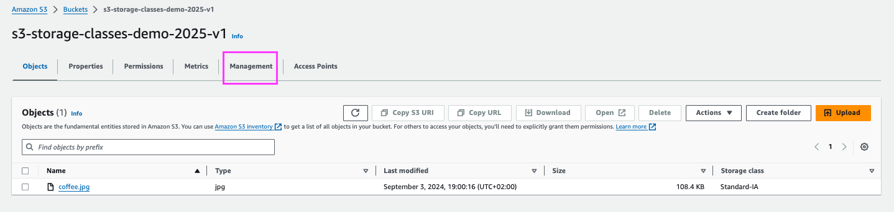

Let's go under Management and create a lifecycle rule. 


This one is going to be called DemoRule, and we apply it to all the objects in the bucket, and I acknowledge it.

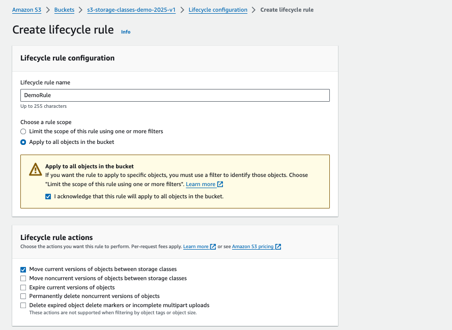

you can see we have five different rule actions. We can move current versions of objects between storage classes, move non-current versions of objects between storage classes, expire current versions of objects, permanently delete non-current versions of objects, and finally, delete expired objects, delete markers, or incomplete multi-part uploads. So, five different use cases. Let's have a look at them one by one.

**move current version objects between storage classes**, 

it means that you have a versioned bucket, and the current version is the most recent version—the one displayed to the user. For example, we can transition to standard IA after 30 days. Then, we can move to each IA after 60 days. After that, we can go into Glacier for instant retrieval after 90 days. Then, after 180 days, we can move to flexible retrieval. Finally, we might archive to deep archive after 365 days. You can have as many transitions as you want, okay? And we need to check the box to acknowledge what we do.


**move non-current versions faster**. 

For this, we want to move an object that is non-current—meaning an object that has been "overridden" by a newer one. We could say, "Okay, we want to move it to Glacier flexible retrieval because we know that after 90 days, we won't need it for immediate retrieval, so this is perfect." And we're good to go, but we could add more transitions.

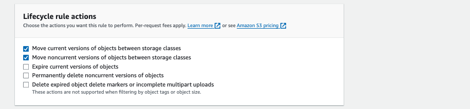


For example, we might want to **expire current versions of objects**, and at the bottom, you can set it up to happen after 700 days. 

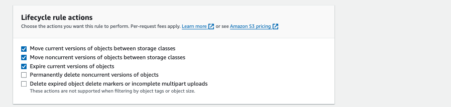  
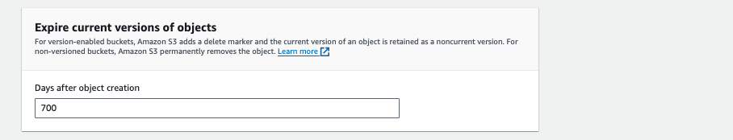  

Similarly, for non-current objects, we want to permanently delete them after 700 days as well, okay? So, this is something we can do.

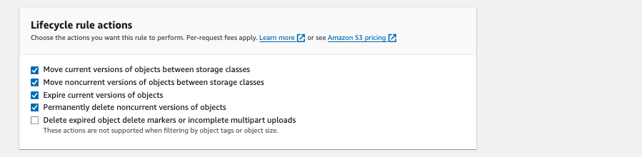


Now we can have a look at all these transitions and expiration actions. This is nice because it shows you a timeline of what is going to happen to your current and non-current versions of your objects. 


If we're happy with all of this, we can just go ahead and create this rule. This rule will act in the background to do what it's supposed to be doing.

That's it. Now you know how to automate moving objects in our industry between different storage classes. I hope you liked it, and I will see you in the next lecture.


### S3 - Event Notifications

So now let's talk about S3 event notifications. The idea is that new events are going to happen in Amazon S3. What are events? Well, events are things such as when an object is created, an object is removed, an object is restored, or there is replication happening. You can filter these events. For example, you can specify that you only want to consider objects that end with ".jpeg".

The use case for event notifications would be, for example, to automatically react to certain events happening in Amazon S3. For instance, if you want to generate thumbnails of all the images uploaded to Amazon S3, you can create an event notification and send it to a couple of destinations. These destinations could be an SNS topic, an SQS queue, or a Lambda function. Don’t worry if you are not familiar with these services yet; we will cover them in the next lectures.

You can create as many S3 events as you desire, and you can send them to any target you want. The idea is that these events are typically delivered within seconds to their destinations, but sometimes it can take a minute or longer.


#### S3 - Event Notifications – IAM Permissions

For the event notifications to work, we need to have the correct IAM permissions. For example, if the S3 service is sending data to an SNS topic, we need to attach what’s called an SNS Resource Access Policy. This is an IAM policy that you attach to the SNS topic, allowing the S3 bucket to send messages directly to the SNS topic. Similarly, if we use SQS, we create an SQS Resource Access Policy that authorizes the S3 service to send data to our SQS queue.

Finally, for a Lambda function, we need a Lambda Resource Policy attached to our Lambda function to ensure that Amazon S3 has the right to invoke our function. Here, we don’t use IAM roles for Amazon S3; instead, we define Resource Access Policies on the SNS topic, the SQS queue, or the Lambda function. These policies function similarly to the S3 bucket policy we used before.

So, you should remember that SNS, SQS, and Lambda functions are event notification targets. 


#### S3 - Event Notifications with Amazon EventBridge

But now, there's a fourth integration that you will also learn about. All events from your Amazon S3 bucket end up in Amazon EventBridge, no matter what. From EventBridge, you can set up rules to send these events to over 18 different AWS services as destinations. This really enhances the capability of S3 event notifications.

We will explore EventBridge later on in this course, but with EventBridge, you get advanced filtering options—much more than before. You can filter by metadata, object size, and name, send to multiple destinations simultaneously, set up step functions, use data streams or Firehose, and access features directly from Amazon EventBridge, such as archiving events, replaying events, and achieving more reliable delivery.

Okay, there’s a lot we haven’t covered in this lecture about the new services, but let's just focus on Amazon S3 event notifications. The idea is that you can react to events happening in Amazon S3 by sending them to SQS, SNS, Lambda, or Amazon EventBridge.


* **Advanced filtering** options with JSON rules (metadata, object size, name...)
* **Multiple Destinations** – ex Step Functions, Kinesis Streams / Firehose…
* **EventBridge Capabilities** – Archive, Replay Events, Reliable delivery

### S3 - Event Notifications - Hands On

So let's go ahead and demonstrate S3 event notifications. For this, I'm going to create a bucket. 

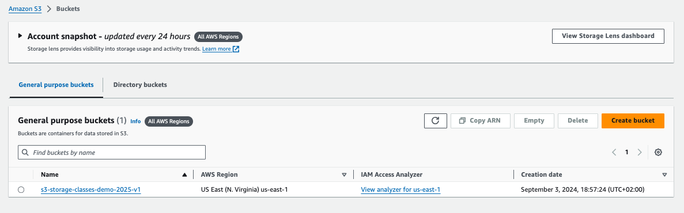

I'll call it `demo-alexjust--event-notifications`. Once I'm ready, I will just go ahead and create my bucket.


click **`Create bucket`**

Okay, so my bucket is created. I'm going to go into it. Now, I'm going to make sure that event notifications are set up. So I go to **`Properties`**, scroll down, and then here we have `event notifications`.

As you can see, we have two options. Number one is to `create an event notification`, and I will show you this in a second. Number two is to enable the `Amazon EventBridge` integration to send all events from this S3 bucket to EventBridge. 


To do this, you just turn it `on`, and you're good to go.


If I wanted to, I could use Amazon EventBridge to capture the events happening in my S3 bucket.

However, I'll show you the simpler way first, because it's a bit more straightforward, which is to just create an `event notification` and send it, for example, to SQS.


I'll call this one demo-event-notification. Then, we can set up a prefix or a suffix, but I won't do that now. 


Next, we need to choose event types. We want to react to all object create events. This means that any time an object is created, an event is going to be triggered. If you want, you could get more granular and select specific types of events, but to keep it simple, I'll leave it at that. You can also include, for example, object removals or object restores, and on the right-hand side, it shows you all the events you can catch. I'll keep it simple and just scroll down. As you can see, there are lots of different events you can react to in Amazon S3.


Then, you need to publish to a destination. We have three options: Lambda functions, SNS topics, and SQS queues. I'm going to choose SQS queue, but first, we need to create a queue and authorize Amazon S3 to publish messages to that destination. 


So, what I'm going to do now is go into Amazon SQS and create a queue. 

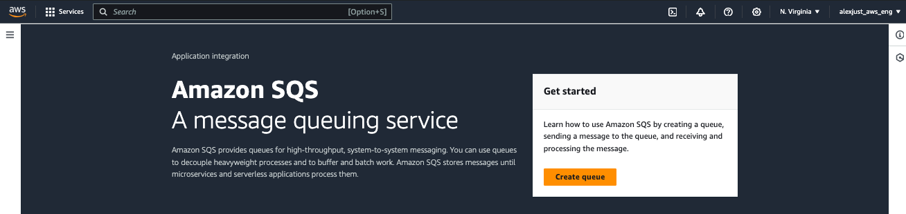

I'll call this one `demo-S3-notification`. I'll go ahead and **`create queue`**.

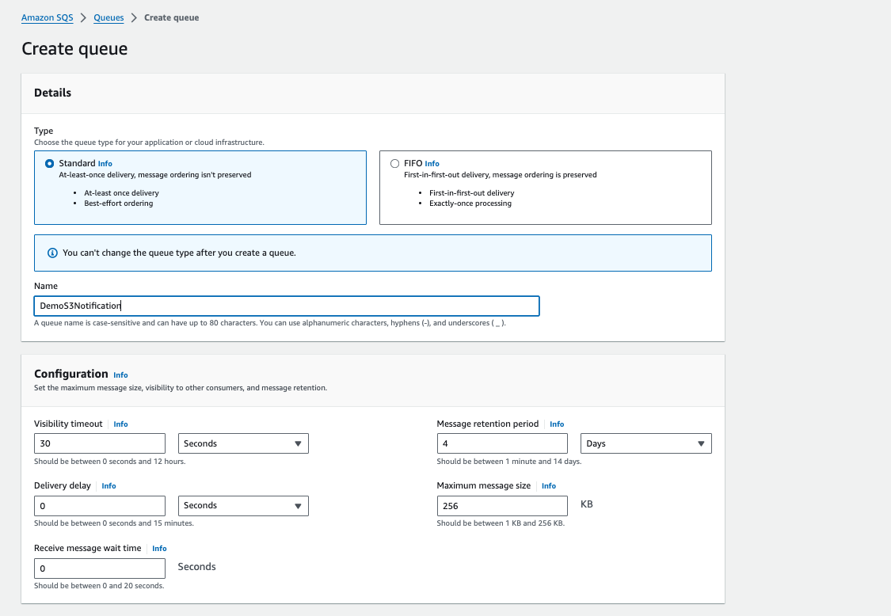

and it's created. 

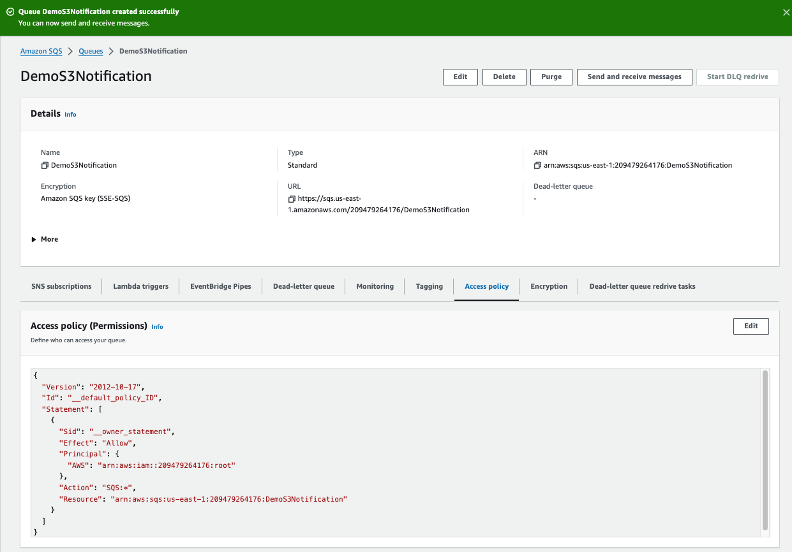

Now, I need to update the access policy to allow my S3 bucket to write to my SQS queue.

To demonstrate the issue, if I go back here and refresh the page to see my queue appear, 


I refresh it, select `demo-S3-event`, choose `all object create events`, scroll down, and then choose the SQS queue. I can select the queue from the dropdown, demo-S3-notification. 

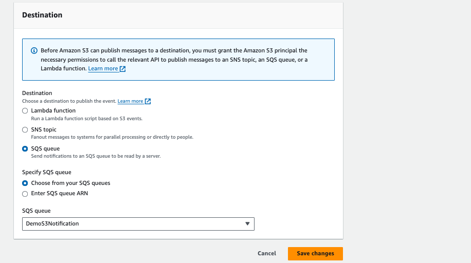


However, if I try to save my changes, I get an unknown error saying that it can't validate the destination configuration 


because this SQS queue does not yet accept messages from my S3 bucket.


To resolve this, I need to change the access policy by clicking on "Edit." 

Scroll down to where the access policy is, and we need to generate a new policy. 


So, I go to the policy generator. It will be an SQS queue policy, 
* Princial : **`*`**
* Actions : **`send messages`**
* Amazon Resource Name (ARN) : 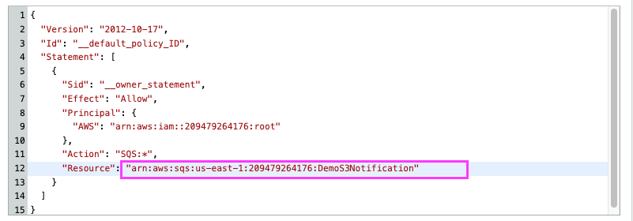

I add a statement and then generate this policy. 


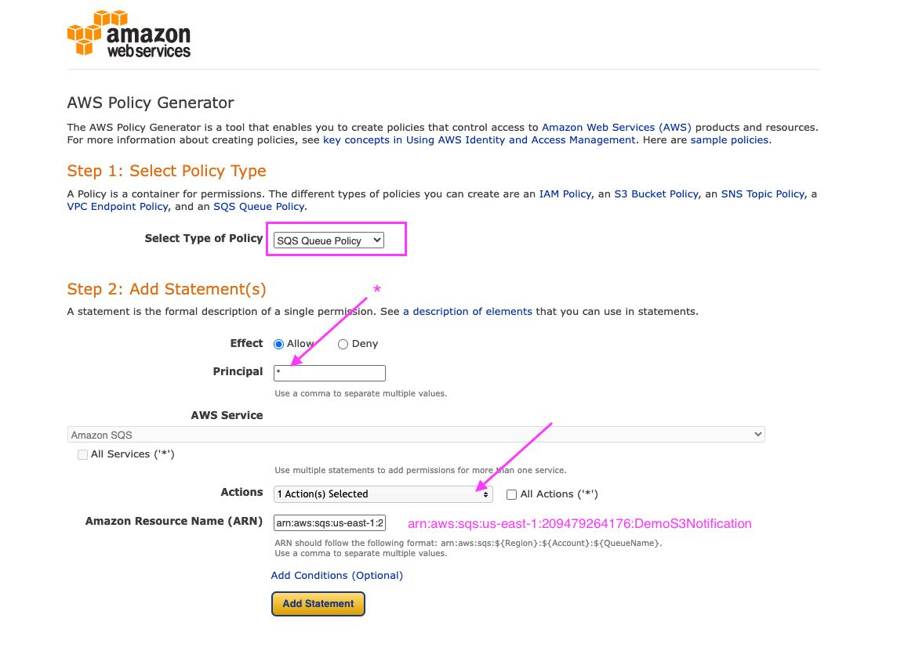


Now, this is the policy I want to use, which allows anyone to write to my SQS queue. It's very permissive, but it will work. Click below to edit. To save the policy, copy the text below to a text editor. Changes made below will not be reflected in the policy generator tool.


Changes the policy generator tool.


Let's **`save`** this, and now my access policy has been updated.


So, if I go back and try to save my changes again, 


**`save changes`** as you can see, the operation was successfully completed. 


What happened is that if I go into my SQS queue and click on "Send and receive messages," 


then click on "Poll for messages," 

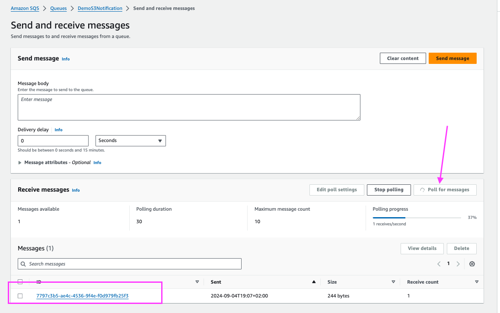

you can see a message was sent by Amazon S3 to test the connectivity. 

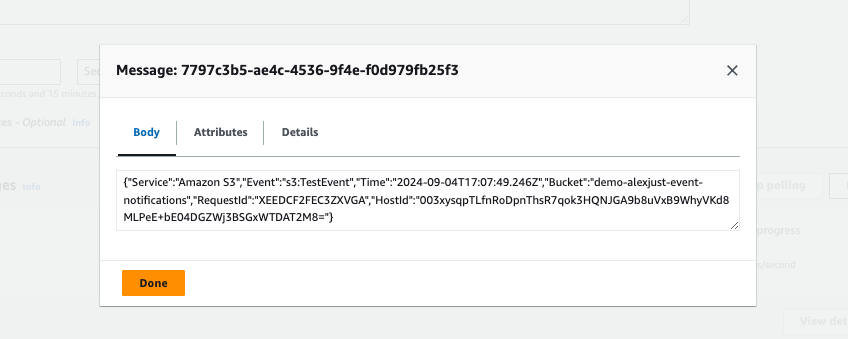

I can take this message and delete it.


Now, we want to test whether the S3 event notification is working with SQS. So, we're going to upload an object. 

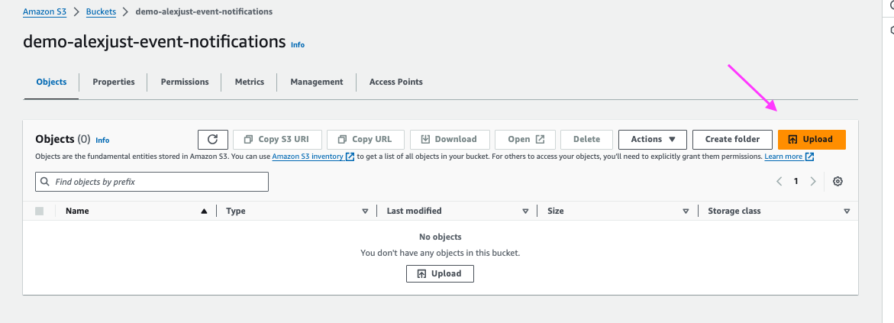

Click on "Add files" and choose our coffee.jpeg. I will upload this file. Now, the file has been uploaded, and if I go into my bucket, I can see that my coffee.jpeg has been created.

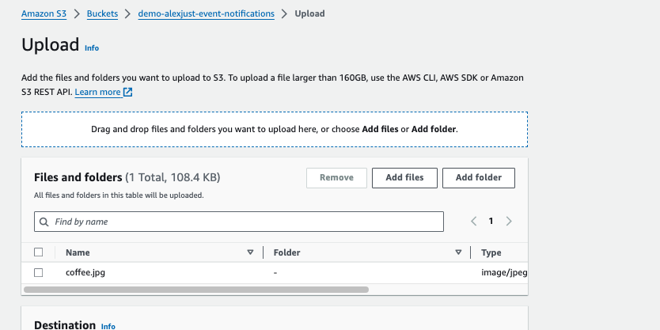

`uploaded`

and if I go into my bucket, 


I can see that my coffee.jpeg has been created.

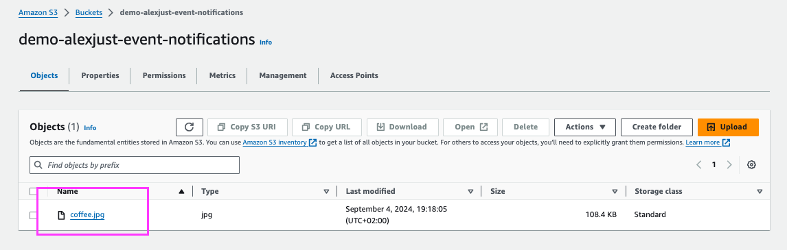


Imagine we want to automate this process and create a thumbnail from it. We would need to have a message in our SQS queue to process it and create a thumbnail.

Therefore, I'm going to poll for messages again, and as you can see, a message was created here.


you can see a message was sent by Amazon S3 to test the connectivity. 

So, the object was indeed created. If we look deeper, we'll see that the **`key`** of that message is **`coffee.jpeg`**. So, the coffee.jpeg was created, and it generated a whole event in my SQS queue. This demonstrates the power of S3 event notifications.


I can delete the message, and we're done.


Okay, that's it. We've seen S3 event notifications. Remember, you can send notifications to SQS, SNS, Lambda, and Amazon EventBridge for further processing and sending to more destinations.

`Amazon S3` > `Buckets` > `demo-alexjust-event-notifications`


### Amazon S3 - Performance

We have to talk about the S3 baseline performance. By default, Amazon S3 automatically scales to a very, very high number of requests and has a very, very low latency, between 100 and 200 ms to get the first byte out of S3. This is quite fast. In terms of how many requests per second you can get, you can get 3500 put-copy-post-deletes per second per prefix or 5500 get-head requests per second per prefix in your buckets. This is something you can get on the website, and I think it's not very clear, so I'll explain to you what per second per prefix means. But what that means overall is that it's really, really high performance, and there's no limit to the number of prefixes in your buckets. Let's take an example of four objects named File, and let's analyze the prefix for that object. The first one is in your bucket, in folder 1, subfolder 1, slash File. In this case, the prefix is going to be anything between the bucket and the file. So in this case, it is slash folder 1 slash sub 1. So that means that for this file, in this prefix, you can get 3500 puts and 5500 gets per second. Now if we have another folder, 1 and then sub 2, the prefix is anything between bucket and file, so slash folder 1 slash sub 2, and so we get also 3500 puts and 3500 gets for that one prefix, and so on. So if I have 1 and 2, we have different prefixes. And so it's easy now to understand what a prefix is, and so it's easy to understand the rule of 3500 puts and 3500 gets per second for a prefix in a bucket. So that means that if you spread reads across all the four prefixes above evenly, you can achieve 22,000 requests per second for head and gets.

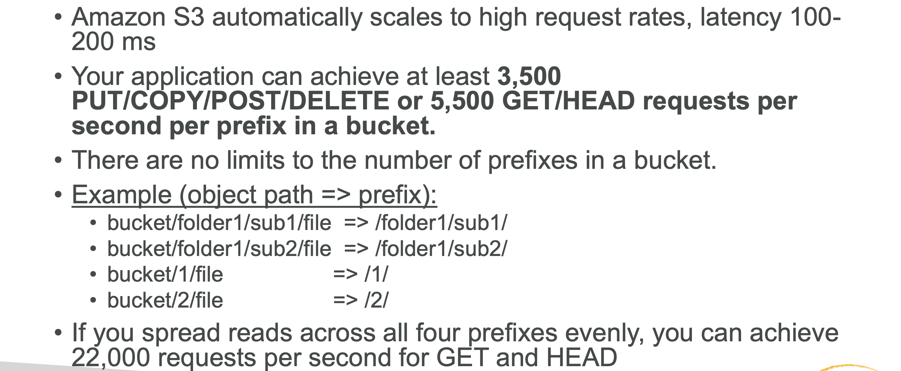

Now let's talk about S3 performance, how we can optimize it. The first one is multi-part upload. So it is recommended to use multi-part upload for files that are over 100 megabytes, and it must be used for files that are over 5 gigabytes. And what multi-part upload does is that it parallelizes uploads, and that will help us speed up the transfers to maximize the bandwidth. So as a diagram, it always makes more sense. So we have a big file, and we want to upload that file into Amazon S3. We will divide it in parts, so smaller chunks of that file, and each of these parts will be uploaded in parallel to Amazon S3. And Amazon S3, once all the parts have been uploaded, it's smart enough to put them together back into the big file. Okay, very important. Now we have S3 transfer acceleration, which is for upload and download, and it is to increase the transfer speed by transferring a file to an NMS edge location, which will forward then the data to the S3 bucket in the target region. So edge locations, there are more than regions. There are about over 200 edge locations today, and it's growing. And let me show you in the graph what that means. And that transfer acceleration is compatible with multi-part upload. So let's have a look. We have a file in the United States of America, and we want to upload it to an S3 bucket in Australia. So what this will do is that we will upload that file through an edge location in the United States, which will be very, very quick, and then we'll be using the public Internet. And then from that edge location to the Amazon S3 bucket in Australia, the edge location will transfer it over the fast private NMS network. So this is called transfer acceleration because we minimize the amount of public Internet that we go through, and we maximize the amount of private NMS network that we go through. So transfer acceleration is a great way to speed up transfers. 


Okay, now how about getting files? How about reading the file in the most efficient way? We have something called an S3 Byte-Range Fetches.

**S3 Performance – S3 Byte-Range Fetches**

And so it is to parallelize gets by getting specific byte ranges for your files. So it's also in case you have a failure to get a specific byte range, then you can retry a smaller byte range, and you have better resilience in case of failures. So it can be used to speed up downloads this time. So let's say I have a file in S3. It's really, really big, and this is the file. Maybe you want to request the first part, which is the first few bytes of the file. Then the second part, and then the end part. So we request all these parts as specific byte range fetches, so it's called byte range because we only request a specific range of the file. And all these requests can be made in parallel. So the idea is that we can parallelize the gets and speed up the downloads. The second use case is to only retrieve a partial amount of the file. For example, if you know that the first 50 bytes of the file in S3 are a header and give you some information about the file, then you can just issue a header request, a byte range request for the headers using the first, say, 50 bytes, and you will get that information very quickly. All right, so that's it for S3 performance. We've seen how to speed up uploads, downloads. We've seen the baseline performance, so make sure you know those until going into the exam, and I will see you in the next lecture.


### Amazon S3 – Object Encryption

So now let's talk about object encryption in Amazon. So you can encrypt objects in S3 buckets using one of the following four methods. The first one is server-side encryption, SSE, and you have multiple flavors of it. So you have SSE S3, which is server-side encryption with Amazon S3 managed keys, and that is enabled by default for your buckets and your objects. Then we have SSE KMS, where we encrypt this time with a KMS key to manage the encryption key. Then we have SSE C, to use customer-provided keys, so this time to provide the own encryption key. And don't worry, we'll see all of these in great detail in the next slide, so this is just an overview. And then we have client-side encryption, where we want to encrypt everything client-side and then upload it to Amazon S3. So at the end, it's important to understand which ones are for which situation, so let's do a deep dive into all of those and understand the specificities of them. 

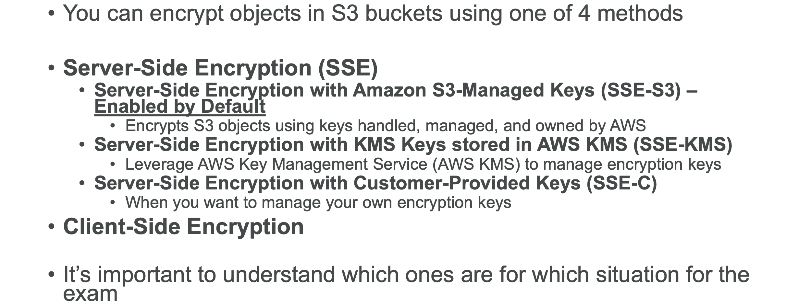


#### S3 Encryption – SSE-S3

So the first one is Amazon S3 for SSE S3 encryption. So in this case, the encryption is using a key that's handled, managed, and owned by AWS. You never have access to this key. The object is going to be encrypted server-side by AWS, and the security type of the encryption is AES-256. Therefore, you must set the header to XAMZ server-side encryption AES-256 to request Amazon S3 to encrypt the object for you using the SSE S3 mechanism. Now SSE S3 is enabled by default for new buckets and new objects. So how does that work with Amazon S3? In our user, the user, you, you're going to upload a file with the correct header, and then it will be an object under Amazon S3. Amazon S3 will pair it with the S3-owned key, because we're using the SSE S3 mechanism, and then we'll perform encryption by mixing the key and the object, and that will be what will be stored on your S3 buckets. So that's for the simpler one, SSE S3. 

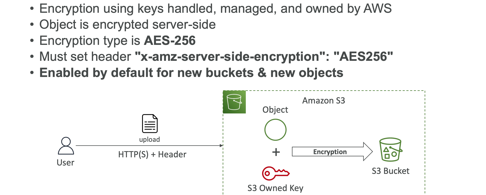


#### S3 Encryption – SSE-KMS

Then we have SSE KMS. So this time, instead of relying on the key that is owned by AWS and the S3 service, you want to manage your own keys yourself using the KMS service, the Key Management Service. So the advantage of using KMS is that you have user control over this key, so you can create keys yourself within KMS, and you can audit the key usage using Cloud Trail. So anytime someone uses a key in KMS, this is going to be logged in a service that logs everything that happens in AWS called Cloud Trail. So for this, we must have a header called the XAMZ server-side encryption AWS KMS, and then the object will be encrypted server-side. So anything SSE, of course, is server-side. So how does that work? Well, again, we upload the object, this time with a different header, and in the header we actually specify the KMS key we want to use. Then the object is appearing in Amazon S3, and this time the KMS key that's going to be used is coming out of the AWS KMS. So these two things together are going to be blended, and then you're going to get encryption, and that's the file that's going to end up in the S3 buckets. So now to read that file from the S3 buckets, not only do you need access to the object itself, but also to the underlying KMS key that was used to encrypt this object. So this is another level of security. 

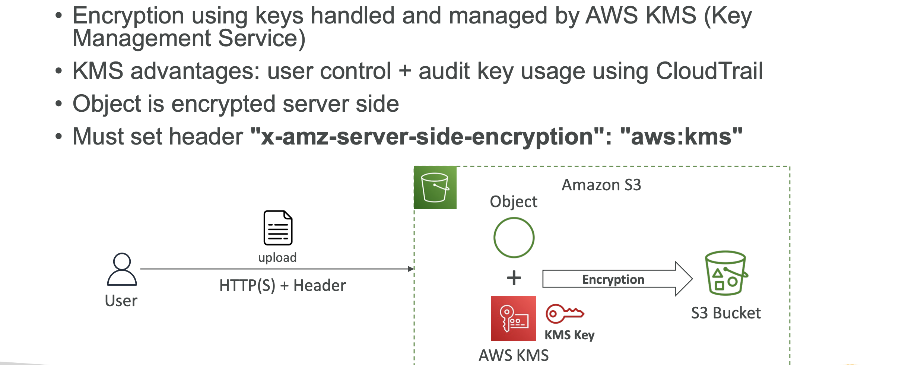

**SSE-KMS Limitation**

So SSE KMS has some limitations, because, well, now that you upload and download files from Amazon S3, you need to leverage the KMS key. And the KMS key has its own APIs, for example, generateDataKey, and when you decrypt, you're going to use the decrypt API, and so therefore you're going to do API calls into the KMS service. And each of these API calls is going to count towards the KMS quotas of API calls per second. So based on the region, you have between 5,000 and 30,000 requests per second, although they can be increased using the service quotas console. And so if you have a very, very high throughput S3 bucket, and everything is encrypted using KMS keys, you may go into a throttling kind of use case. So this is something the exam may test you on.


#### S3 Encryption – SSE-C

Next, we have the SSE-C type of encryption. So this time, the keys are managed outside of AWS, but it's not server-side encryption because we send the key to AWS. But Amazon S3 will never store the encryption key you provide. After they're used, they're being discarded. So in that case, because we transmit the key into Amazon S3, we must use HTTPS, and we must pass the key as part of HTTP headers for every request being made. So how does that work? The user is going to upload a file as well as the key, but the user manages the key outside of AWS. And then Amazon S3 will use the client's provided key and the object to perform some encryption, and then put the file as encrypted into an S3 bucket. And of course, to read that file, the user must again provide the key that was used to encrypt that file.

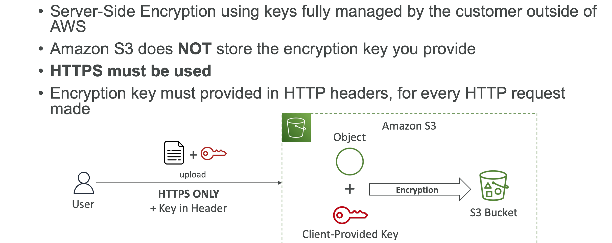

#### S3 Encryption – Client-Side Encryption

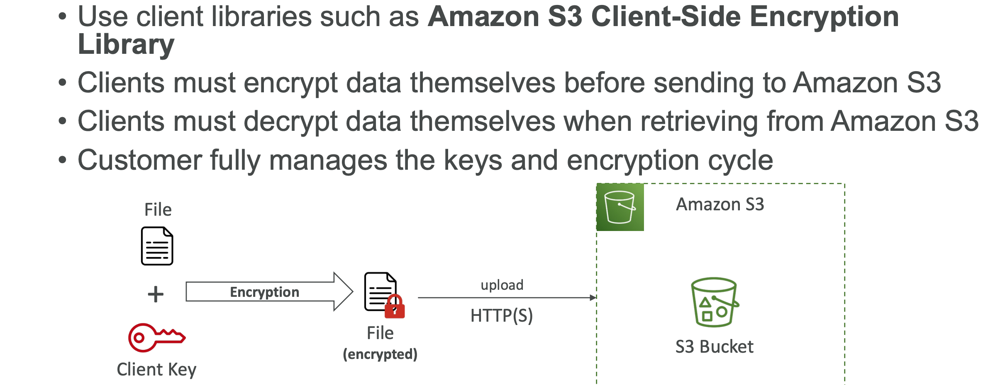

#### S3 – Encryption in transit (SSL/TLS)

Finally, we have the client-side encryption. So this is easier to implement if we leverage some client library, such as the client-side encryption library. And the idea with client-side encryption is that the clients must encrypt data themselves before sending data to Amazon S3. And also, you can retrieve the data from Amazon S3, and then the decryption of the data happens on the client, outside of Amazon S3. Therefore, the client fully manages the keys and the encryption cycle. So how does that work? We have a file, and we have a client key that's outside of AWS. The client itself is going to provide and perform the encryption. So now we have an encrypted file, and that file, as is, can be sent into Amazon S3 or upload. So we've seen all the levels of encryption of objects, but now let's talk about encryption in transit. So encryption in transit, or in-flight, is also called SSL or TLS. And basically, your Amazon S3 bucket has two endpoints, the HTTP endpoint that is non-encrypted, and the HTTPS endpoint that has encryption in-flight. So anytime you visit a website and you see a green lock or a lock, usually it means it's using encryption in-flight, meaning the connection between you and the target server is secure and fully encrypted. And therefore, when you're using Amazon S3, it's fully recommended to use HTTPS to have a secure transmission of data, of course. And if you use the SSC type of mechanism, you must use the HTTPS protocol. Now, this is not something to worry about in real life, because, well, most clients would use the HTTPS endpoint by default.

* Encryption in flight is also called SSL/TLS
* Amazon S3 exposes two endpoints:
  * HTTP Endpoint – non encrypted
  * HTTPS Endpoint – encryption in flight
* HTTPS is recommended
* HTTPS is mandatory for SSE-C
* Most clients would use the HTTPS endpoint by default

#### S3 – Force Encryption in Transit aws:SecureTransport

Now, how would you go about forcing encryption in transit? For this, we could use a bucket policy. So you attach a bucket policy to your S3 bucket, and you attach this statement, which is saying that you deny any get object operation if the condition is AWS secure transport false. So secure transport is going to be true whenever you're using HTTPS and false whenever you're not using an encryption and encrypted connection. And so therefore, any user trying to use HTTP on your bucket is going to be blocked, but users using HTTPS may be allowed. Okay, so that's it for encryption. I hope you liked it. And I will see you in the next lecture.


#### DSSE-KMS

In the next lecture, when doing the hands-on you will realize a new encryption option is available, named DSSE-KMS and released in June 2023.

DSSE-KMS is just "Dual-Layer Server Side Encryption based on KMS".

### S3 - Encryption - Hands On


So let's practice encryption. And for this, I'm going to create a bucket called `demo-encryption-alexjust`. 

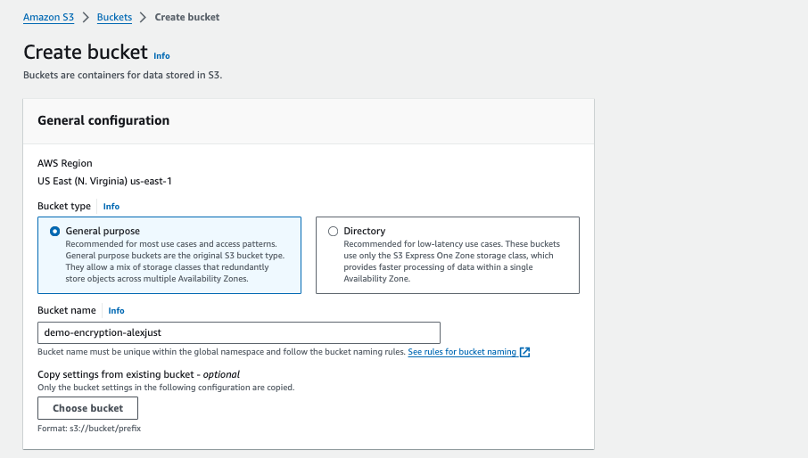

As we scroll down. We're going to **`enable bucket versioning`**. Then, under default encryption, as you can see, we have three different options. We must choose a default encryption for our bucket. I will go over SSE-S3 right now, and we'll look at SSE-KMS and DSSE-KMS later on. So let's click on Create Bucket.


 Now, we have created a bucket with default encryption turned on. Let's verify this by actually uploading an object. We need to add a file, and we'll add our coffee.jpg file. 
 
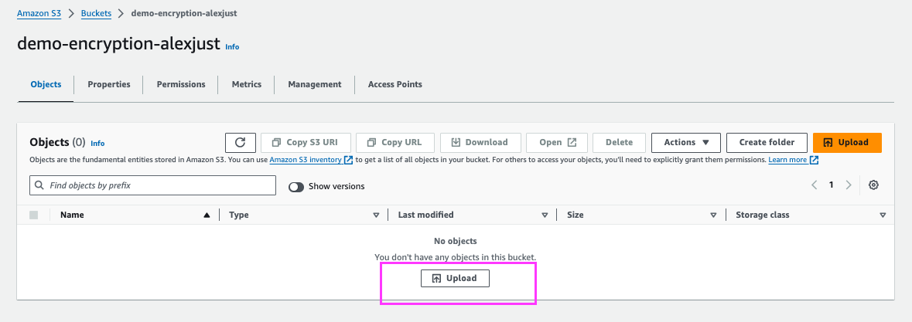
 
 Then we're just going to click on Upload. 
 
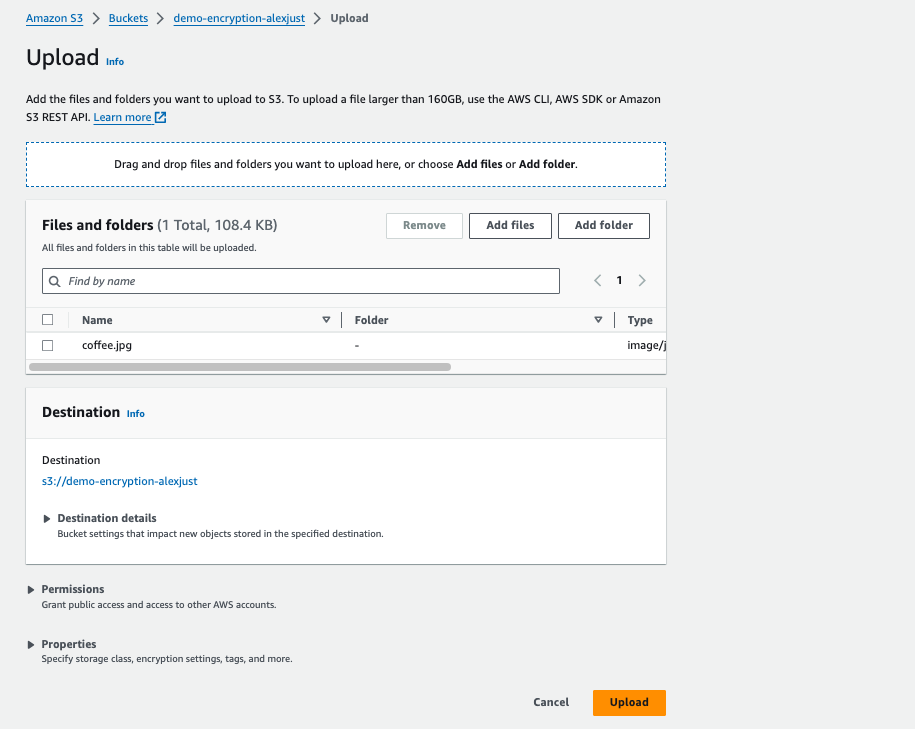

As you can see now,

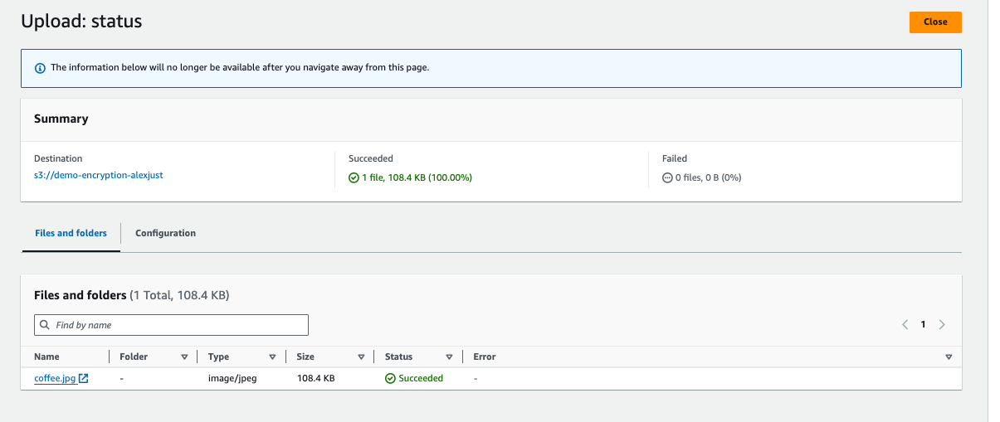
 
I can click on this file, scroll down, and look for the **`server-side encryption settings`**. Indeed, the file was encrypted with `server-side encryption using Amazon S3 managed keys`, or **SSE-S3**. We can also edit the encryption mechanism for a file. I can just click on Edit, 

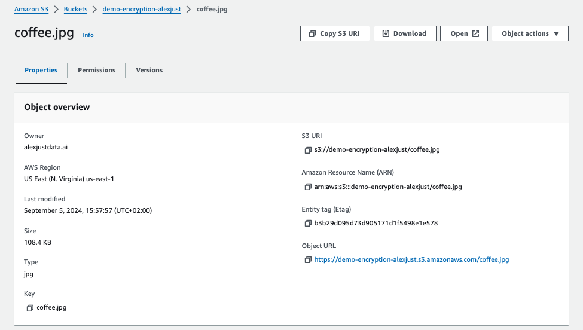


and as you can see, if we do **`edit`** the server-side encryption, it will create a new version of the object with updated settings. Therefore, this is why I enabled versioning for my bucket: to show you that a new version of the file will be created. 

Let's change the encryption. For this, we're going to **`override the bucket settings for default encryption`** for this one object. 

We have a choice to use either **`SSE-KMS`** or **`DSSE-KMS`**. I won't spend a lot of time on DSSE-KMS; it's just two levels of encryption on KMS, so a stronger KMS. We're just going to use KMS right now. It is simpler, and it won't cost us any money. So, we're going to use SSE-KMS, as we learned, and then specify a KMS key. 

We can either enter a KMS key ARN or choose from **`your own KMS keys`**. If we choose from the KMS keys right now, we should have one key available, the AWS/S3 key. It's called the default KMS key for the S3 service. If you click on it, we can use this key, and that's not going to cost us any money because it's the default key for the service. If you created your own KMS key, it would be available in this list, but creating your own KMS key will cost you some money every month. For this purpose, we're just going to use the default AWS/S3 KMS key. 


Okay, let's **`save the changes`**. We **`close`** this. 

Now, if we go under versions, you can see we have two versions of our file available. The current version, 


in **`Properties`** if we `scroll down` and go under **`server-side encryption`**, is indeed encrypted with SSE-KMS with this encryption key, which corresponds to the default AWS/S3 KMS key. 

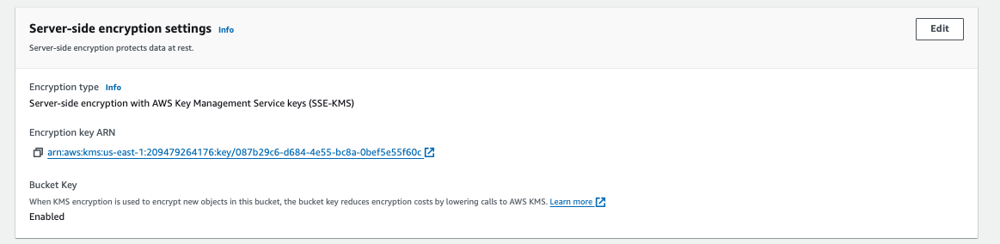

This is really good. 

Next, we go under this part. We can do the same process by uploading a file, 


adding a file, for example, **`upload`** -> `beach.jpeg`. 

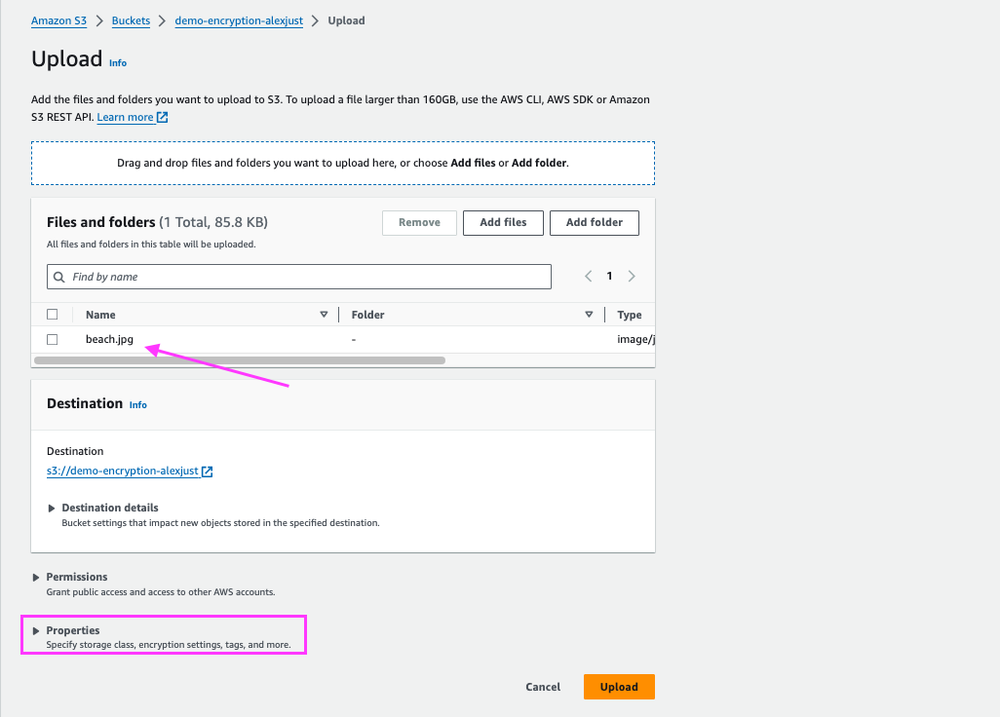

Under **`properties`**, we'll find `server-side encryption`. Here we can specify an encryption key to either use the `default encryption` mechanism or `override it with SSE-S3, SSE-KMS, or DSSE-KMS`. This is when we are doing it. 

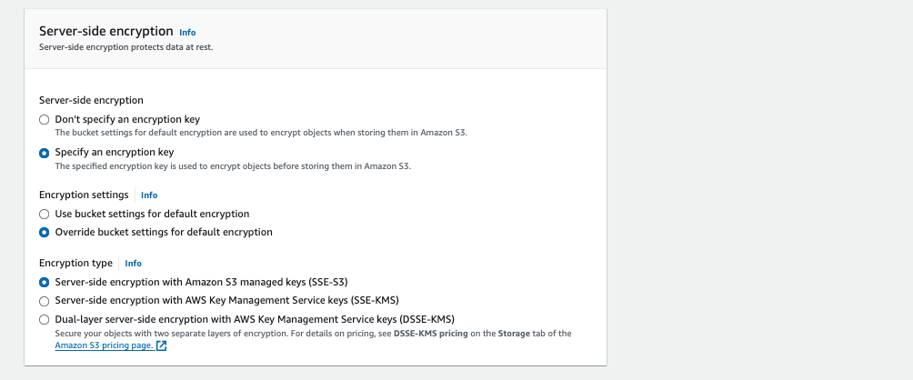

**`cancel`**

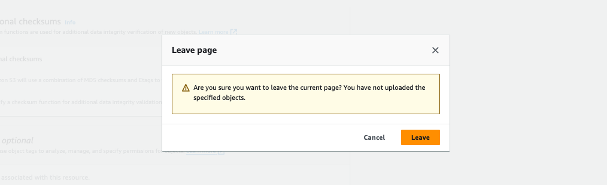

Finally, let's look at the default encryption **`properties`**. 
Scroll down, and we'll find default encryption. Let's edit this, and here are the options. 

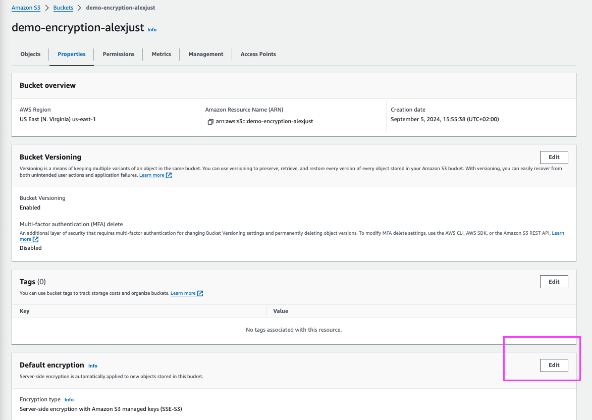

We can enable SSE-S3, SSE-KMS as the default encryption, or DSSE-KMS. In case we use SSE-KMS, we have the bucket key option available to us. This is to reduce the cost by making fewer API calls to AWS KMS, and so this is enabled by default. 

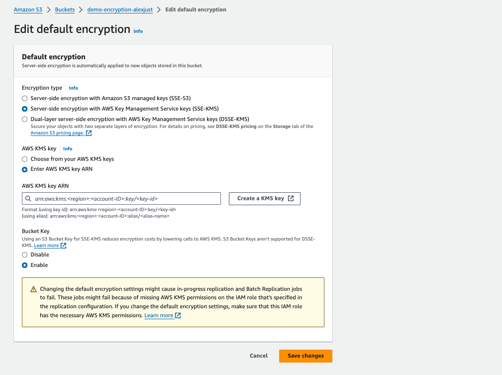

If we use SSE-S3, then this setting doesn't work. We've seen that we can change the default encryption here. You may ask me, well, SSE-C is missing. Indeed, it is missing because SSE-C can only be done from the CLI, not from the console. That means you cannot enable SSE-C right here. Finally, for client-side encryption, you have to encrypt everything client-side, then upload it to AWS, and decrypt it client-side, so you don't need to tell AWS that the data is client-side encrypted. Therefore, the only options you can deal with in the console are SSE-S3, SSE-KMS, and DSSE-KMS. That's it. We've seen all the encryption options in AWS. 

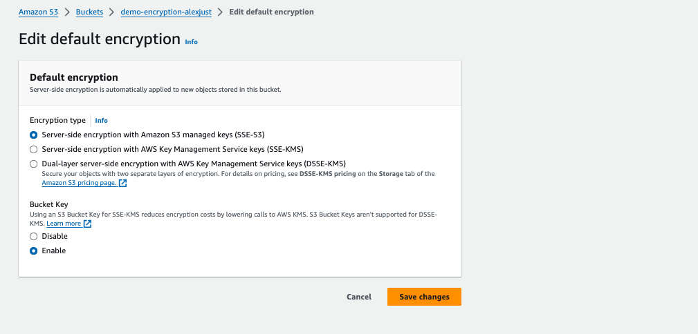

### S3 - Default Encryption vs. Bucket Policies

This was just a short lecture on default encryption versus bucket policies. By default, all the buckets now have default encryption.

* SSE-S3 encryption is automatically applied to new objects stored in S3 bucket
* Optionally, you can “force encryption” using a bucket policy and refuse any 


* Note: Bucket Policies are evaluated before “Default Encryption”


### S3 - Acces Points

So now let's talk about S3 access points. So let's take an example of an S3 bucket that has a lot of data. We have finance data, we have sales data, and we have different users or groups that want to access their data. We could create a very complicated S3 bucket policy and make it grow over time. The more users, the more data that you have, the more unmanageable this may become. 

So what is the solution? Well, we can create what's called S3 access points. So we can, for example, create a finance access point that is going to be connected to the finance data. 

How is it connected to the finance data? Well, we're going to define an access point policy, and this policy looks just like an S3 bucket policy, and it's going to grant read-write access to the finance prefix. Then we can define a sales access point. Again, this will be connected to the sales data thanks to an access point policy, a different one attached to this access point, which is going to grant read-write access to the sales prefix. 


As you can see, I now have two policies, and if I want to have an analytics access point, well, we can create it so that it points to finance and sales, but in read-only access. So we're going to create our own read-only policy on the analytics access point. So as you can see here, we have pushed the security management from the S3 bucket policy into the access points, and each access point will have its own security. Therefore, with the proper IAM permissions, then our users can access the finance access point and connect only to the finance part of our bucket. The users as well for sales can only access the sales, and the analytics group can access finance and sales at the same time. 

So by using access points, we define different ways to access our S3 bucket, and the result of that is that we have a very simple way to manage security. We have policies attached to each access point, and also we have a very simple bucket policy on Amazon S3. Therefore, we can really scale access to our S3 buckets. So to summarize, access points simplify security management for S3 buckets, and each access point will have its own DNS name, that's how you connect to the access points. You can choose it to be connected to the internet as an origin or a VPC for private traffic, and then you attach again an access point policy, which is very similar to a bucket policy, and this allows you to manage security at scale.

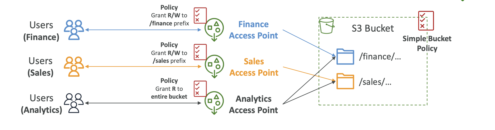

* Access Points simplify security management for S3 Buckets
* Each Access Point has:
  * its own DNS name (Internet Origin or VPC Origin)
  * an access point policy (similar to bucket policy) – manage security at scale


**S3 – Access Points – VPC Origin**

Regarding the VPC origin of S3 access points, we can define them to be privately accessible. So that's, for example, an EC2 instance in a VPC accesses without going through the internet, our S3 bucket, through the VPC access point, through a VPC origin. So to do so, to get access to this VPC origin, we must create what's called a VPC endpoint to access the access points, so it's something in our VPC that will allow us to connect privately into the access point through our VPC origin. And then this VPC endpoint has a policy, and this policy must allow access to the target bucket and the access point, so the VPC endpoint policy will allow our EC2 instance to connect to both the VPC, the access point on Amazon S3, and the S3 bucket. So in this case, we have VPC endpoint for security, we also have security for the access point policy, and security at the S3 bucket level. All right, that's it for access points, 

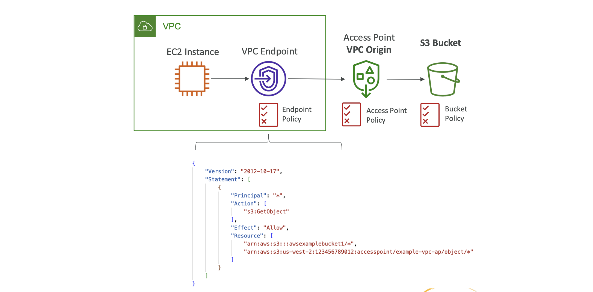

• We can define the access point to be accessible only from within the VPC
• You must create a VPC Endpoint to access the Access Point (Gateway or Interface Endpoint)
• The VPC Endpoint Policy must allow access to the target bucket and Access Point

### S3 - Object Lambda

So there's another use case for S3 access points, and it's called S3 Object Lambda. 

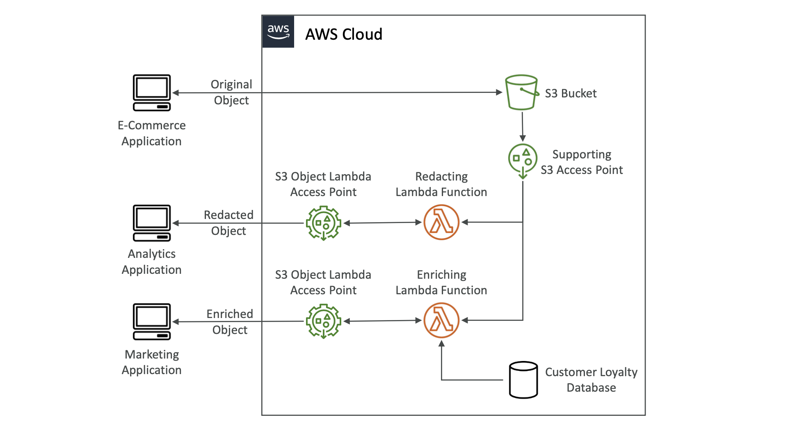

So the idea is that you have an S3 bucket, but you want to modify the object just before it is retrieved by a caller application. And instead of, for example, duplicating our bucket to have different versions of each object, we can use S3 Object Lambda instead. And for this, we need the S3 access points that we just saw. So how does that work? Say we have the cloud and we have an S3 bucket in it. So an e-commerce application maybe owns the data in this S3 bucket, and so they're able to access directly the S3 bucket and put and get the original object out of it. But then an analytics application may want to only have access to the redacted object. That means that some data has been deleted from the object. And so instead of creating a new S3 bucket for this, what we can do is create an S3 access point on top of our S3 bucket, and it's connected to a Lambda function. Now we haven't seen Lambda in depth, but a Lambda function allows you to run a bit of code in the cloud very easily. And so this Lambda function is going to redact the object as it is being retrieved. And on top of this Lambda function, we're going to create an S3 Object Lambda access point. And this is how the analytics application is going to access our S3 bucket. So to summarize, the analytics application accesses our S3 Object Lambda access point, which invokes our Lambda function. Our Lambda function is going to retrieve the data from the S3 bucket and run some code to redact the data. And therefore, the analytics application is obtaining a redacted object from the very same S3 bucket as the e-commerce application. Now, a marketing application may want to have access to an enriched object, and they have a customer loyalty database to enhance the data. So instead of again creating a new S3 bucket and creating all the objects with all the enriched data, what we can do is, again, use a Lambda function. So another piece of code, and this one will enrich the data by looking it up from the customer loyalty database. And therefore, we can also create an Object Lambda access point on top of it. And therefore, our marketing application can access this S3 Object Lambda access point to get again the enriched objects. As you can see, we only need one S3 bucket, but we can create access points and Object Lambdas to modify the data as we wish. So the use cases for it are to redact, for example, PII data—personally identifiable information—for analytics or non-production environments, or, for example, to convert data from XML to JSON, or to perform any kind of transformation you want, for example, resizing and watermarking images on the fly, where the watermark is specific to the user who requests the object. So that's kind of a cool usage for S3 Object Lambda. So I hope you liked it, and I will see you in the next lecture.


* Use AWS Lambda Functions to change the object before it is retrieved by the caller application
* Only one S3 bucket is needed, on top of which we create **S3 Access Point** and **S3 Object Lambda Access Points**.
* Use Cases:
  * Redacting personally identifiable information for analytics or non-production environments.
  * Converting across data formats, such as converting XML to JSON.
  * Resizing and watermarking images on the fly using caller-specific details, such as th


## EC2 Instance Storage Section

Welcome to this section where we will look at the different storage options for EC2 instances. 

### EBS (Elastic Block Store)

**What’s an EBS Volume?**

So first, the most important ones are going to be EBS volumes, so let's define what they are. An EBS volume stands for Elastic Block Store. It's a network drive that you can attach to your instances while they run. And we've been using them without even knowing. These EBS volumes allow us to persist data even after the instance is terminated, and that's the whole purpose. We can recreate an instance and mount the same EBS volume from before, and we'll get back our data. That is very helpful. So these EBS volumes, at the CCP level, can only be mounted to one instance at a time. And when you create an EBS volume, it is bound to a specific availability zone. That means that you cannot have an EBS volume created in, for example, US-EAST-1A, attached to an instance in US-EAST-1B. We'll see this in the diagram in a second. So how do you think of EBS volumes? Well, you can think of them as network USB sticks. So it's a USB stick that you can take from a computer and put in another computer, but you actually don't physically put it in a computer. It's attached through the network. The feature gives us 30 gigabytes of free EBS storage of type general purpose, SSD or magnetic, per month. And in this course, we'll be using this with the GP2 or GP3 volumes.

* An `EBS (Elastic Block Store) Volume` is a `network` drive you can attach to your instances while they run
* It allows your instances to persist data, even after their termination
* They can only be mounted to one instance at a time (at the CCP level)
* They are bound to a specific availability zone
* Analogy: Think of them as a “network USB stick”
* Free tier: 30 GB of free EBS storage of type General Purpose (SSD) or Magnetic per month

**EBS Volume**

Now let's look at it. EBS volumes are a network drive, as I said. It's not a physical drive. So to communicate between the instance and the EBS volume, it will be using the network. And because the network is used, there may be a bit of latency from one computer to another server. Now, EBS volumes, because they are a network drive, can be detached from an EC2 instance and attached to another one very quickly. And that makes it super handy when you want to do failovers, for example. EBS volumes are locked to a specific availability zone. That means, as I said, if it's created in US-EAST-1A, it cannot be attached to US-EAST-1B. But we will see in this section that if we do a snapshot, then we are able to move a volume across different availability zones. And finally, it's a volume, so you have to provision capacity in advance. You need to say how many gigabytes you want in advance and the IOPS, which are IO operations per second. You're basically defining how you want your EBS volume to perform. You're going to get billed for that provisioned capacity. And you can increase the capacity over time if you want to have better performance or more size.

* It’s a network drive (i.e. not a physical drive)
  * It uses the network to communicate the instance, which means there might be a bit of latency
  * It can be detached from an EC2 instance and attached to another one quickly
* It’s locked to an Availability Zone (AZ)
  * An EBS Volume in us-east-1a cannot be attached to us-east-1b
  * To move a volume across, you first need to snapshot it
* Have a provisioned capacity (size in GBs, and IOPS)
  * You get billed for all the provisioned capacity
  * You can increase the capacity of the drive over time

**EBS Volume - Example**

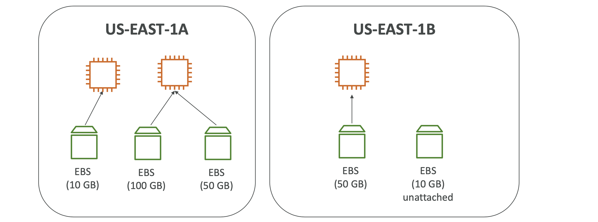

So as a diagram, what does it look like? Well, we have US-EAST-1A. We have one EC2 instance, and we can attach, for example, one EBS volume to that EC2 instance. If we create another EC2 instance, as I said, an EBS volume cannot be attached to two instances at a time at the certified client practitioner level. Therefore, this other EC2 instance needs to have its own EBS volume attached to it. But it is very possible for us to have two EBS volumes attached to one instance. Think of it as two network USB sticks into one machine. That makes a lot of sense. Now, EBS volumes are linked to an availability zone. So as you can see, all this diagram has been so far using US-EAST-1A. If you want to have other EBS volumes in another AZ, then you would need to create them separately in the other availability zone. So just as your EC2 instances are bound to an AZ, so are the EBS volumes.

**EBS – Delete on Termination attribute**

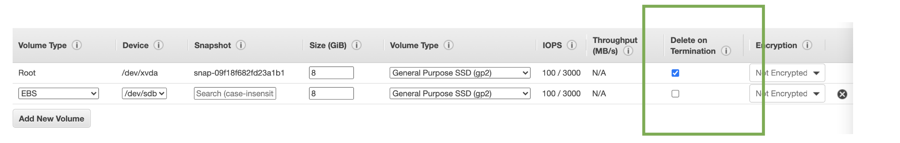


Finally, it is possible for us to create EBS volumes and leave them unattached. They don't need to be necessarily attached to an EC2 instance. They can be attached on demand, and that makes it very, very powerful. Finally, when we go ahead and create EBS volumes through EC2 instances, there is this thing called a delete-on-termination attribute. And this can come up in the exam. If you look at this, when we create an EBS volume in the console, when we create an EC2 instance, there is the second-to-last column called delete-on-termination. By default, it is ticked for the root volume and not ticked for a new EBS volume. This controls the EBS behavior when an EC2 instance is being terminated. By default, as you can see, the root EBS volume is deleted alongside the instance being terminated, so it's enabled. And by default, any other attached EBS volume is not deleted because it's disabled by default. But obviously, as we can see in this UI, we can control if we want to enable or disable delete-on-termination. And so a use case would be, for example, if you want to preserve the root volume when an instance is terminated, for example, to save some data, then you can disable delete-on-termination for the root volume, and you'll be good to go. That could be an exam scenario.


### EBS - Hands On

https://github.com/alexjust-data/AWS_Certified_Cloud_Practitioner?tab=readme-ov-file#ebs-hands-on


### EBS - Elastic Volumes

* You don’t have to detach a volume or restart your instance to change it!
  * Just go to actions / modify volume from the console
* Increase volume size
  * You can only increase, not decrease
* Change volume type
  * Gp2 -> Gp3
  * Specify desired IOPS or throughput performance (or it will guess)
* Adjust performance
  * Increase or decrease


### EFS – Elastic File System

https://github.com/alexjust-data/AWS_Certified_Cloud_Practitioner?tab=readme-ov-file#efs--overview

EFS is a managed NFS, which is a network file system. And because it's a network file system, it can be mounted on many EC2 instances, and these EC2 instances can also be in different availability zones. That's the whole power of EFS. It's highly available, very scalable, and expensive—it's about three times the cost of a GP2 EBS volume—and you pay per use, so you don't have to provision capacity in advance. Let me explain.

You have your EFS file system, and you surround it with a security group. Then, you can have EC2 instances, many of them, in the US-East-1A availability zone, for example, or EC2 instances in the US-East-1B or US-East-1C availability zones, and they can all connect at the same time to the same network file system through EFS.

* Use cases: content management, web serving, data sharing, Wordpress
* Uses NFSv4.1 protocol
* Uses security group to control access to EFS
* Compatible with Linux based AMI (not Windows)
* Encryption at rest using KMS
  
* POSIX file system (~Linux) that has a standard file API
* File system scales automatically, pay-per-use, no capacity planning!

The use cases of EFS include content management, web serving, data sharing, and WordPress. It uses the NFS protocol internally, and to control access to your EFS, you need to set up a security group. It's important to note that EFS is only compatible with Linux-based AMIs, not Windows. You can enable encryption at rest in your EFS drive using KMS. EFS is a standard file system on Linux, so it uses the POSIX system and has a standard file API.

The cool thing about EFS is that you don’t need to plan the capacity in advance. The file system will scale automatically, and you pay per use for each gigabyte of data stored in EFS. 

### EFS – Performance & Storage Classes

Now, let’s talk about the different performance and storage classes.

In terms of scale, EFS supports thousands of concurrent NFS clients and more than 10 gigabytes of throughput. It can grow to a petabyte-scale network file system automatically, which is really nice. You can also set the performance mode at the time of EFS network file system creation, and there are several options. The first is General Purpose, which is the default. It's used for latency-sensitive use cases, such as web servers or CMS. But if you want to maximize throughput, you have MaxIO, which has higher latency but higher throughput and is highly parallel. It's great for big data applications or media processing needs.

For throughput modes, you have different options. The first is Bursting. For example, 1 terabyte of storage gives you 50 megabytes per second, with bursts up to 100 megabytes per second. You don’t have to remember the exact numbers, but that gives you an idea. Then, there’s Provisioned, where you can specify the throughput regardless of your storage size. So, for example, you could have 1 gigabyte per second of throughput for 1 terabyte of storage. That’s useful because you’ve decoupled your throughput from your storage. Finally, you have Elastic, which automatically scales the throughput up and down based on your workload. For example, you can get up to 3 gigabytes per second for reads and 1 gigabyte per second for writes based on your workload. This is great for unpredictable workloads.

* **EFS Scale**
  * 1000s of concurrent NFS clients, 10 GB+ /s throughput
  * Grow to Petabyte-scale network file system, automatically
* **Performance Mode (set at EFS creation time)**
  * General Purpose (default) – latency-sensitive use cases (web server, CMS, etc…)
  * Max I/O – higher latency, throughput, highly parallel (big data, media processing)
* **Throughput Mode**
  * **Bursting** – 1 TB = 50MiB/s + burst of up to 100MiB/s
  * **Provisioned** – set your throughput regardless of storage size, ex: 1 GiB/s for 1 TB storage
  * **Elastic** – automatically scales throughput up or down based on your workloads
    * Up to 3GiB/s for reads and 1GiB/s for writes
    * Used for unpredictable workloads

### EFS – Storage Classes

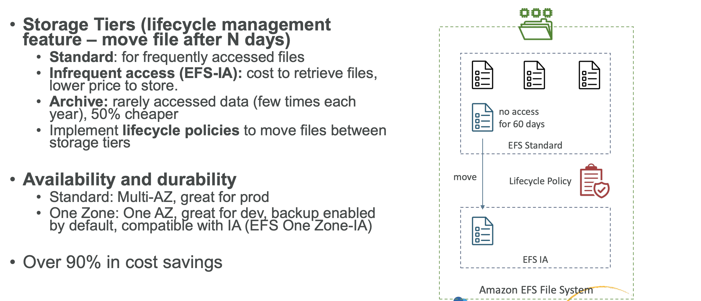

For storage classes, we have several options. There are storage tiers, which are a lifecycle management feature that allows you to move files to different storage tiers after a certain number of days. You have the Standard tier, which is used for frequently accessed files, and the EFS IA (Infrequent Access) tier, which has a lower storage cost but a fee to retrieve files. Then, there’s the Archive storage tier, used for rarely accessed data—perhaps data accessed only a few times a year—making it a lot cheaper to store.

To move your files automatically between storage tiers, you can implement lifecycle policies, which let you define after how many days a file should be moved to a specific tier. For example, if you have files in EFS Standard and one of them hasn’t been accessed for 60 days, you can set up a lifecycle policy to move it to EFS IA.

In terms of availability and durability, Standard is great for a multi-AZ setup, where your EFS spans multiple availability zones, making it ideal for production workloads as it's resistant to disasters. But if you just want to do development or have cheaper options, you can choose One Zone, which gives you a single availability zone with backups, and it's also compatible with IA storage tiers. So, you have the EFS One Zone IA option as well.

By using the right EFS storage classes, you can achieve up to 90% in cost savings, which is very helpful.

### EFS - Hands On

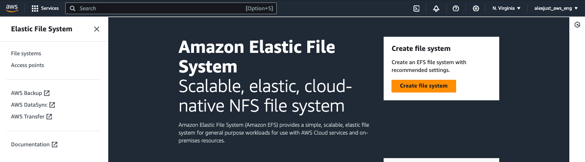

So let's go ahead and practice using the Amazon Elastic File System service. Let's create our file system. Here, we can give it an optional name, but I'll leave it empty. We have to choose a VPC where we want to connect our file system. We'll leave it as the default VPC as well. We could just click Create and be done, but I want to show you the options. 

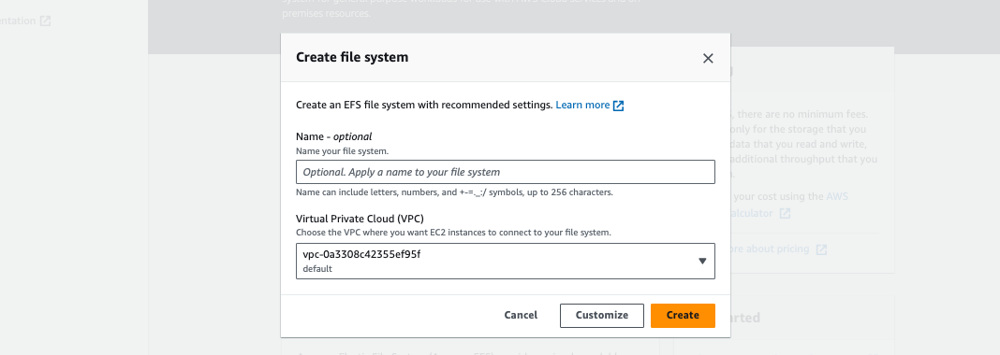


So let's click on Customize.

Again, we'll leave the name empty and optional. Next, we need to choose a file system type. 

We have two options: 
* `Regional`, which gives you a file system within a region across multiple availability zones, providing very high availability and durability of data. 
* But if you want to reduce costs, you could use the `One Zone` option, in which case you choose a specific availability zone. This is good for development environments, but not for production environments, because if that availability zone becomes unavailable, then your data will be inaccessible. 

So, for production settings, you'll definitely want to use Regional, and we'll use Regional for this hands-on.

Next, we can enable or disable `automated backups`, but it's recommended to keep them enabled. 

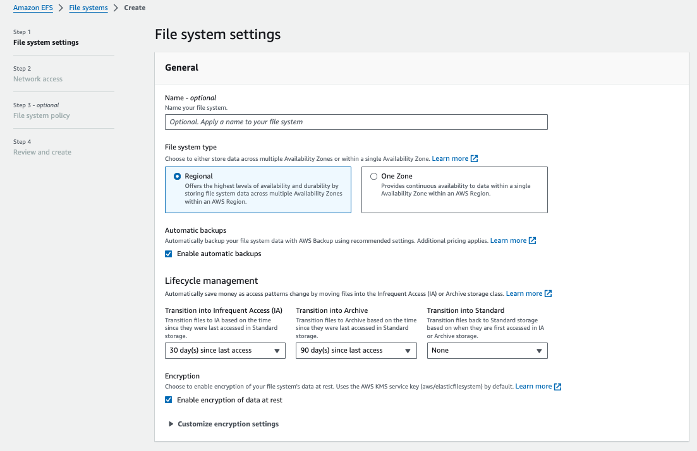

After that, we have `Lifecycle Management`, which moves data across different storage tiers to save costs. You can transition data to Infrequent Access or Archive and back to Standard. For example, you can set it so that if a file hasn’t been accessed for 30 days (you can customize this), it moves to the Infrequent Access storage tier, which will be cheaper—except when you access the file. The assumption is that after 30 days, the file is rarely accessed. If a file hasn’t been accessed in, say, 90 days, you can move it to the Archive, which is even cheaper. Then, if the file is accessed again, it can automatically transition back to Standard, as it might be reused more frequently. This is Lifecycle Management, and we’ll keep it on.

Next is Encryption, which we’ll leave enabled—that's perfect. 

Then, we have `Performance Settings`, specifically `Throughput Mode`, with three options: Elastic, Provisioned, and Bursting. Let’s start with Bursting. Bursting allows the throughput to scale with the amount of storage you're using, and it can exceed the normal limits temporarily—that’s why it’s called bursting. For example, if you have 1 gigabyte of storage, you get throughput based on that; if you have 1 terabyte, you get higher throughput.

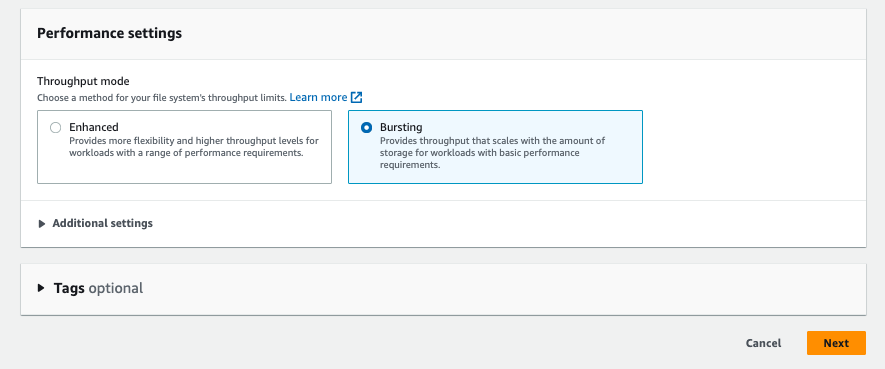

Now, let's look at `Elastic`. Elastic is recommended because, regardless of the size of your EFS file system, it provides all the I/O you need and scales automatically. You only pay for what you use, making it ideal for workloads with unpredictable I/O demands, where throughput can scale from 0 to 100 megabytes per second quickly. This is why `Elastic is the recommended` mode—it requires no manual settings.

Finally, we have Provisioned mode, which is used when you know in advance the amount of throughput you’ll need. For instance, you could specify that you'll need 100 megabytes per second of throughput, and there’s also a bursting limit of 300 megabytes per second. Since throughput is provisioned in advance, you'll pay for it in advance. Elastic is generally the recommended setting.

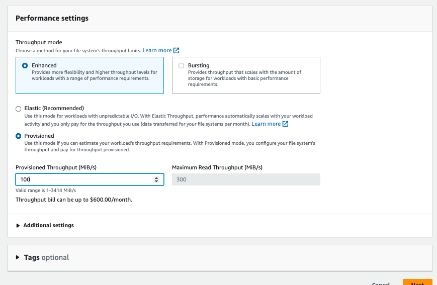

Under Additional Settings, we have General Purpose and Max I/O. With Elastic, you get the I/O you need based on your performance requirements, so General Purpose is the only option for Performance Mode. However, if you use Bursting or Provisioned, you can choose between two settings: General Purpose, which offers low-latency, high-performance for latency-sensitive applications, and Max I/O, which is for highly parallelized workloads and can tolerate higher latency in exchange for greater throughput. This is ideal for big data scenarios.

The best recommended setting from AWS is to use Enhanced with General Purpose and Elastic throughput mode. Hopefully, this isn't too confusing. I don’t love that under Enhanced, there’s both Elastic and Provisioned. Really, there are just three options: Bursting, Elastic, and Provisioned, and those are what you should remember for the exam.

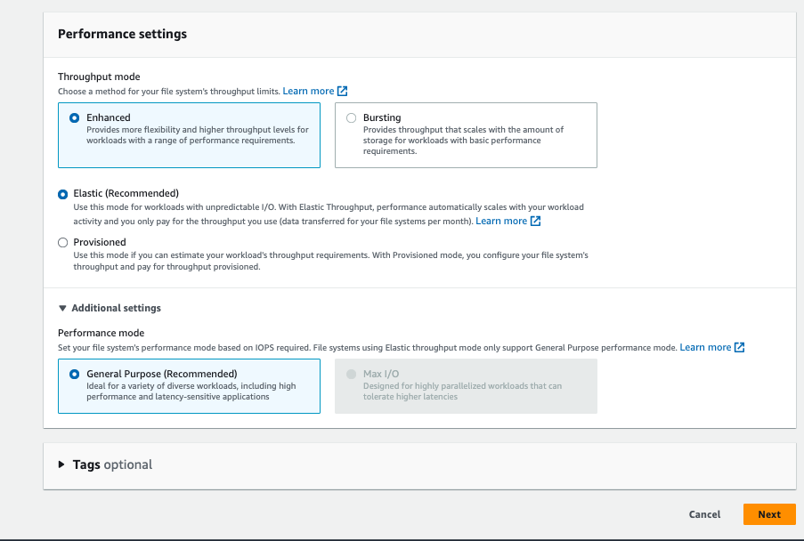

Let's click on **Next** now. Okay, so my EFS demo is created successfully. 

The next step involves **`Network Access`** settings. We have the network access settings, and they're very important. We have to choose a `VPC`, so I'll choose the default VPC. 

Then, the **mount targets** —because we've chosen a regional type of EFS file system—will be `available` across three AZs. Each AZ is going to be assigned a `subnet`. I'll leave it as is and choose the default subnet. The `IP` is automatic, and we need to assign a `security group`. So, we need to go ahead and create a specific security group for my EFS system.

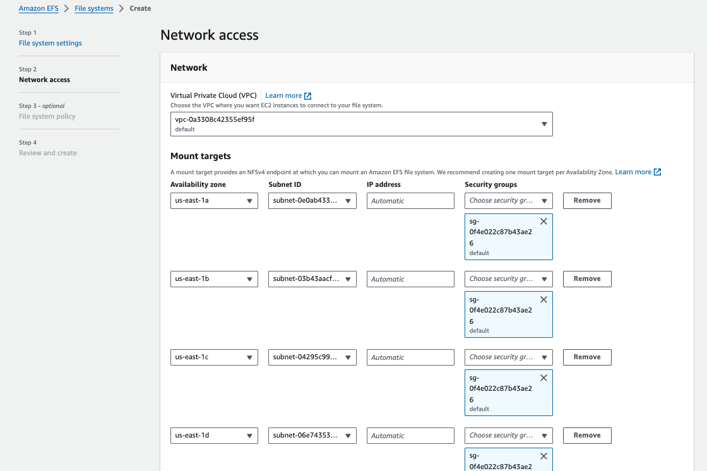


I'll go into the **`EC2 Console`**, then go to Security Groups, and create a new security group. 

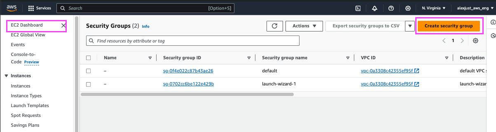
 

 
I'll call it `efs-demo`, and give it a description like EFS Demo SG. 

For now, we won’t configure any `inbound rules`. 


I'll **`click Create Security Group`**, and the group will be created successfully. Okay, so my EFS demo is created successfully, what I need to do is to refresh the page; the default ones that we come next; the default ones that we come next. And now I can remove these security groups and choose the EFS demo security group that I have created from before.


06:07

So now we have done all the network access configuration. I'll click **`Next`**.

Next, we have the File System Policy section, which is optional, and we won't modify it now as it’s more advanced and unnecessary for this setup.


So I will click on Next.

Once we're happy with everything, we'll click **`Create`**.


click **`Create`**. Now, my file system is being created, and I'll update you once it's ready.


My file system is now available. I can go into it and see that 6 kilobytes of size is currently being used. With EFS, you only pay for the storage you use, so my current cost is zero. That’s good, and now that the file system is created, we want to mount it onto EC2 instances.


So, the next step is to create EC2 instances. 


So, the next step is to create EC2 instances. Let’s launch some instances. 

I’ll name the first one Instance A because we will launch it in the subnet of AZA. We’ll use Amazon Linux 2. Everything looks good to go. We'll use a t2.micro instance because it’s free to use. 


We’ll disable the key pair and use EC2 Instance Connect to access our instance. For network settings, I’ll leave everything as is, and a new security group will be created with rules to allow SSH access from anywhere, which is good.

There’s 8 gigabytes of GP2 storage, but since we want to configure the storage of the EC2 instance to mount the Amazon EFS, we can now do this from within the EC2 console, which is exciting. Let me show you how. Under File Systems, you can click Edit, 


but you cannot add a file system until a subnet is selected. 


`You currently have no file systems on this instance. You must select a subnet before you can add an EFS file system.`

So, we scroll back up to Network Settings, click Edit,


and select EU West 1A as the subnet. 


Once that’s done, we can go back to File Systems. Now, we can add an EFS or FSx file system. We’ll choose to add an EFS file system and click Add Shared File System.


The system will link to my EFS, and the mount point will be /mnt/efs/fs1. That works for us. The security groups will be automatically created and attached, which is great. It will also automatically mount the shared file system by attaching the required user data scripts, which we previously had to run manually on the EC2 instance. This automation is a great improvement.


Let’s create this instance and **`launch instance`**.


**instance B**

Once the instance is launched, I can view all instances. Now, let’s launch a second instance, and I’ll name it Instance B. Again, we’ll use Amazon Linux 2. To make things quick, I’ll proceed without a key pair. I’ll select EU West 1B as the subnet. 


For the security group, I’ll select the one created earlier, Launch Wizard 2. Then, we need to edit the file system and add the same EFS file system as before, using the same mount point. All the other options will remain as they are. 


Now, we’ll **launch that instance**.


Let’s look at the interesting stuff that has happened. I’ll set the instance state to Running and refresh until both of my instances are running. Now they’re both up. If we go into the EFS Console and check the Network tab, we can see that each availability zone now has multiple security groups. There’s the EFS Demo group we created earlier, along with EFS SG1 and EFS SG2, which were automatically created by the EC2 console and attached to our EFS file system.


If I check the security group for Instance B, for example, I can look at EFS SG2 and view its inbound rules. 


We can see that it allows NFS traffic on port 2049, and the source of this traffic is the security group itself. That security group is attached to Instance B, which allows Instance B to access the EFS file system.


The EFS SG2 security group is also attached to the **instance B**.


We need to access the EFS file system because that security group right here called EFS-SG2 is attached into my EFS file system. So all the setup is done by AWS for us, which is truly nice. 


So now if I go into one of these instances, we're going to `connect` using EC2 instance connect on this tab. 


And then **I will also do the exact same thing by connecting to `instance B`** over EC2 instance connect. 

So now I can, for example, verify the fact that, yes, in ls slash mnt EFS FS1, there is an EFS file system. And now we need to create files in it. So to make it simple, I will elevate to my right and type sudo su. And then I can do echo hello world into the mnt EFS FS1 as a hello.txt. So we've created that file named hello.txt. And if I do cat and then this entire file name right here, as you can see, it says hello world. 

```sh
[root@ip-172-31-20-125 ec2-user]# ls /mnt/efs/fs1/
[root@ip-172-31-20-125 ec2-user]# sudo su
[root@ip-172-31-20-125 ec2-user]# echo "Hello world" > /mnt/efs/fs1/hello.txt
[root@ip-172-31-20-125 ec2-user]# cat /mnt/efs/fs1/hello.txt
Hello world
```

So this file has been created into my EFS file system from this EC2 instance, which is an euwest1a. But now if I go into my second EC2 instance and do ls and then the same file system, so I look for files in it, as you can see, we also see this hello.txt file in it. And if I do cat and then cat the file hello.txt, it says hello world as well. 

```sh
   ,     #_
   ~\_  ####_        Amazon Linux 2023
  ~~  \_#####\
  ~~     \###|
  ~~       \#/ ___   https://aws.amazon.com/linux/amazon-linux-2023
   ~~       V~' '->
    ~~~         /
      ~~._.   _/
         _/ _/
       _/m/'
[ec2-user@ip-172-31-20-125 ~]$ ls /mnt/efs/fs1/
hello.txt
[ec2-user@ip-172-31-20-125 ~]$ cat /mnt/efs/fs1/hello.txt
Hello world
[ec2-user@ip-172-31-20-125 ~]$ 
```


So as you can see, the EFS file system is indeed mounted as a network drive onto both my EC2 instances. And they are in different AZs and they share the same EFS. So that's amazing. And that's a different kind of storage that you have the demo of it right now. 


So that's it for the EFS demo. That was pretty complete. Now to just clean up, what you can do is you can terminate these two EC2 instances. So you go here and you terminate them. 


And something else you can do is you can go into the EFS file system. You can delete it by entering the file system ID.


 And then when everything is deleted, you can go ahead into your security groups and delete the extra security groups that have been created during this demo. Okay, that's it for this lecture. I hope you liked it. 

 ### EBS vs EFS – Elastic Block Storage

 So now let's talk about the differences of EVS volumes and EFS file systems. So the EVS volumes, they're attached to one instance at a time, except in the edge case of using the multi-attach feature of the io1 and io2 types of volume, but that is for very specific use cases. EVS volumes are also locked at the AZ level, so here is an example. We have one EC2 and AZ1, and we have one EVS volume attached to it, and it cannot be attached to an EC2 instance in AZ2. For the GP2 type of volume, the io will increase if the disk size increases, and for the GP3 and io1 type of volumes, you can increase the io independently from your disk size. To migrate an EVS volume across AZ, we need to take a snapshot, so it will go into the EVS snapshots, and then we can restore the snapshot into another AZ. This is how we move from one AZ to the next. Now the EVS volumes backups, they will use io, and so you shouldn't run them while your application is handling a lot of traffic because that may impact the performance. For your EC2 instances, the root EVS volumes of your instances will get terminated by default if the EC2 instance gets terminated, but you can disable that behavior. 


* EBS volumes…
  * one instance (except multi-attach io1/io2)
  * are locked at the Availability Zone (AZ) level
  * gp2: IO increases if the disk size increases
  * gp3 & io1: can increase IO independently
* To migrate an EBS volume across AZ
  * Take a snapshot
  * Restore the snapshot to another AZ
  * EBS backups use IO and you shouldn’t run them while your application is handling a lot of traffic
* Root EBS Volumes of instances get terminated by default if the EC" instance gets terminated (you can disable that)


### EBS vs EFS – Elastic File System

Now for EFS, it's a bit different. So it's a network file system, and the goal is really to attach it to hundreds of instances across availability zones, so we really see the distinction here. So with one EFS file system, we can have different mount targets on different AZs, and then multiple instances can share that one file system together. So it's very helpful for example when you have WordPress, and it's only for Linux instances because it is using the POSIX system. The EFS has a higher price point than EVS, but you can leverage storage tiers for cost savings. So hopefully you understand now the difference between EFS and EVS, and for the instance store, well it is physically attached to the EC2 instance, and so therefore if you lose your EC2 instance, you will lose the storage as well. All right, that's it. I hope you liked it, and I will see you in the next lecture.


## AWS Backup

So, AWS Backup is a fully managed service and it allows you to centrally manage and automate backups across all your AWS services. And the list is getting bigger and bigger by the day. So the idea is that you want to have a central place, you don't want to create any custom scripts or have any manual processes. You want to have a central view of your backup strategy. So supported services are pretty wide. For example, Amazon EC2, EPS, Amazon S3, RDS, and all the database engines supported, Aurora, DynamoDB, DocumentDB, Amazon Nameshare, EFS, FSx, including Illustrator and Windows Cloud Server and probably others. AWS Storage Gateway, such as the Volume Gateway, and more that can come over time. But I'm not necessarily going to update this lecture because, well, it doesn't really matter. The idea is that you get the concept behind AWS Backup and the most important services are shown on this slide.

* Fully managed service
* Centrally manage and automate backups across AWS services
* No need to create custom scripts and manual processes
* Supported services:
  * Amazon EC2 / Amazon EBS
  * Amazon S3
  * Amazon RDS (all DBs engines) / Amazon Aurora / Amazon DynamoDB
  * Amazon DocumentDB / Amazon Neptune
  * Amazon EFS / Amazon FSx (Lustre & Windows File Server)
  * AWS Storage Gateway (Volume Gateway)
* Supports cross-region backups
* Supports cross-account backups

So it supports cross-region backups. This means that you can have your backups pushed to another region for disaster recovery strategy all in one place. And also supports cross-account backups if you are using multiple accounts in your AWS strategy. So it supports point-in-time recovery for supported services, such as Aurora. It supports on-demand and scheduled backups. There's tag-based backup policies to make sure you only backup any resources that have been tagged with production. And you can create backup policies known as backup plans. You define the frequency, for example, every 12 hours or weekly or monthly or whatever cron expression you have. The backup window. If you want to transition the backup itself to cold storage, so never or maybe after some days, some weeks, some months, or some years, and the retention period of your backup. So every, always, or days, weeks, months, and years. So it's quite supportive and comprehensive and it supports really most services. So it's a really nice addition to the AWS services.

* Supports PITR for supported services
* On-Demand and Scheduled backups
* Tag-based backup policies
* You create backup policies known as Backup Plans
* Backup frequency (every 12 hours, daily, weekly, monthly, cron expression)
* Backup window
* Transition to Cold Storage (Never, Days, Weeks, Months, Years)
* Retention Period (Always, Days, Weeks, Months, Years)

So if you have a look at AWS Backup, we create a backup plan, as I said, and then you assign specific AWS resources that are important to you. So here is a list, but it can get bigger. And then once it's done, well, automatically your backup, your data is going to be backed up to Amazon S3 in an internal bucket that is specific to AWS Backup.


### AWS Backup Vault Lock

And another feature that you should know about for AWS Backup is the vault lock. So you enforce a warm write once, read many policy. That means that all your backup that you store in your backup vault cannot be deleted. So the idea is that you know for sure, you can prove it, that thanks to the vault lock policy, you cannot delete your backups. And it provides you an additional layer of defense for your backups against, for example, inadvertent or malicious delete operations or updates that shorten or alter the retention period. And even the root user itself cannot delete backups when enabled. So it gives you strong guarantees on the safety of your backups. Okay, that's all you need to know for the AWS Backup service. I hope you liked it and I will see you in the next lecture.

* Enforce a WORM (Write Once Read Many) state for all the backups that you store in your AWS Backup Vault
* Additional layer of defense to protect
your backups against:
  * Inadvertent or malicious delete operations
  * Updates that shorten or alter retention periods
* Even the root user cannot delete backups when enabled


### AWS Backup - Hands On

So we need to type this backup into the search bar and open the backup service. So we are going to create our first backup plan.


So I'm going to click on Create Backup Plan. And we have three options. 

`Start options`

Either we start with a template, or we build a new plan, or we define a plan using JSON. The simplest for us is to start with a template. And we can have different templates. For example, daily, 35-day retention, daily, monthly, one-year retention, and so on. So let's go with daily, monthly, one-year retention. And I'll call it Test Plan. 

`Backup rules`

Next, you click on Backup Rules. And you see we can have many backup rules in our backup rules. So we have two. We have daily backups and monthly. 


Schedule:

* `Backup Rule Name`: The name of the backup rule, here set as DailyBackups.
Must be between 1 to 50 characters and case-sensitive.

* `Backup Vault`: This is where the backups will be stored. In the screenshot, the default vault selected is aws/efs/automatic-backup-vault. You also have the option to create a new vault if needed.

* `Backup Frequency`: Specifies how often backups are taken. In this case, it's set to Daily backups.

Backup Window:  
* `Start Time`: Specifies the time backups will start. The example shows 05:00 (5 AM) in the Europe/Madrid (UTC+02:00) time zone.
* `Start Within`: Defines a window for when the backup plan should start if it misses the exact * start time. Here, it's set to 8 hours.
* `Complete Within`: This defines the time frame within which the backup job should be completed. It's set to 7 days.
  
Point-in-Time Recovery (PITR): 
* An option to enable continuous backups to restore the backup to a specific point in time. 
* This feature is useful for services like Aurora, RDS, S3, and SAP HANA.


Lifecycle:


`Cold Storage`: 
* You can choose to move backups from warm to cold storage. This is an option for resources like EFS, SAP HANA, Timestream, DynamoDB, and others.
* Cold storage is used for long-term archival, and it requires a minimum of 90 days of retention. In this case, Amazon EBS snapshots can be archived if cold storage is enabled and the backup frequency is at least monthly.
* Total Retention Period: Specifies how long backups are stored. Here it’s set to 35 days. This is the period during which the backup will be kept in warm storage before being deleted or transitioned to cold storage.
  
Copy to Destination (Optional):
* You can choose to copy the backup to a different region or a separate backup vault. This is useful for disaster recovery scenarios where you want the backup in another location.
A region can be selected if you opt for this feature.

Tags Added to Recovery Points (Optional):
* You can add tags to backups (recovery points) for better management and identification. For instance, tags like environment (e.g., "production") can be applied.
There’s an option to add up to 50 tags, but currently, no tags are assigned in the screenshot.


**`"Save Backup Rule"`**

And for monthly, 


well, we get the similar thing. So it's going into the default backup vault. It's monthly on day one of each month. And the rest looks the same. So we actually transition these ones to cold storage after one month. And then we retain them for one year. 


Okay. So we have these ready. And then I can just scroll down and click on **`create plan`**.

So now our test plan is created. And we need to assign resources to it. So I'm going to click on assign resources. And I will just call it test assignments. And so here for iGrow, we're going to use a default role, which is going to create a role for us with the correct permissions. Or you can choose your own one. But let's go with default role. Easy. And then for resource selection, we have two things we can do. Number one, we can include all resource types. Or number two, we can include specific resource types. For example, if you wanted to just have a DynamoDB table, and then you could select the resource you want in there, you could do this. Or if you wanted to, you could have all tables. So it's one way of doing it. Or if you go with all resource types, you really would use this as a combination with tags. And so for tags, you would say, well, if the key environment is equal to the value production, then do a backup. This would be the kind of use cases for backups. But you're free to do anything you want, of course. 


And then when you're done, you click on **`Assign resources`**.


And so just to make it very, very clear, if I went into EC2 and I were to **create an EBS volume**, 


and that volume would have, for example, one gigabyte, and then the key would be environment production, then this would be automatically backed up by my backup plan because it has the correct tags.


So if you look at our volume right now, and we go into tags, as we can see, it has environment production, 


which corresponds to the tags that I've set up for my backup plan. So this is the assignments right here. And we can have multiple assignments as well in here. 


And then that's it. The backup plan is going to run automatically, and then the backups are going to happen here in my backup vault. 

The jobs are the jobs that are going to be scheduled and happening. So we have backup jobs, restore jobs, and copy jobs if we wanted to.


And then we can look at the settings. So the settings is around, do you want to have backup policies, cross-account monitoring, cross-account backups, and so on. 


So we've seen the basics of how backups work. And so that's it. I won't show you all this, okay? That's all you need to know. And I'm going to delete everything. 

So for that, please make sure to delete your EBS volume, or you can wait a day if you wanted to see if the backups work, obviously.


 And then when you're done, you take the assignment and you delete it. 
 

 
So type the name of the assignment in here. And then for the daily backup rules, you can delete them, or delete directly the backup plan. And for this, just enter the name of the backup plan and press delete.


